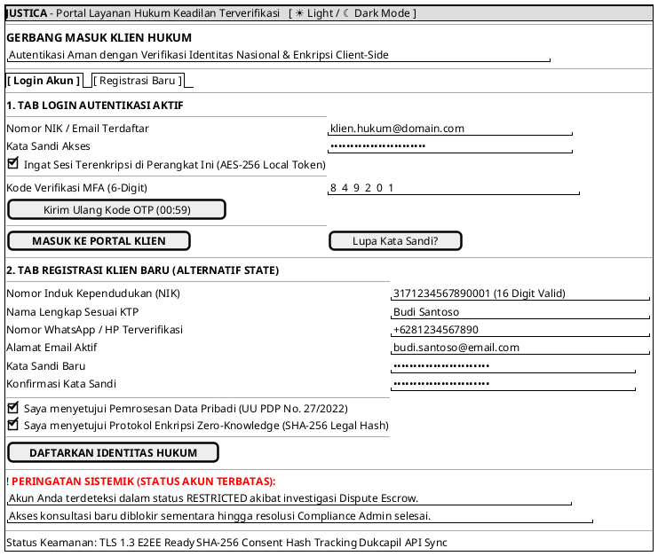

# MOCK-J-CL-01: Portal Registrasi & Login Klien Hukum Justica

## 1. METADATA SPESIFIKASI
| Atribut | Nilai Spesifikasi |
| :--- | :--- |
| **ID Mockup** | `MOCK-J-CL-01` |
| **Nama Halaman** | Portal Registrasi & Autentikasi Klien Hukum Justica |
| **Aktor Target** | Klien Hukum (*Client*) |
| **Ref. Use Case** | `J-UC01` (Registrasi Akun Klien), `J-UC02` (Login Autentikasi MFA) |
| **Ref. Story Backlog** | `ST-J-01` (Registrasi Klien & Consent SHA-256), `ST-J-02` (Login & MFA OTP) |
| **Peta Navigasi (`from` -> `to`)** | `MOCK-J-CL-01` -> `MOCK-J-CL-02` (Katalog Advokat) |

---

## 2. DIAGRAM WIREFRAME LOGIS (PLANTUML SALT)

---

## 3. KAMUS DATA & ELEMEN UI (*DATA FIELD DICTIONARY*)

| ID Elemen | Nama Field UI | Parameter API | Tipe Data | Aturan Validasi & Compliance Gate |
| :--- | :--- | :--- | :--- | :--- |
| `INP-CL01-01` | NIK / Email Login | `login_identifier` | `String` | Harus berupa format Email RFC 5322 valid atau NIK 16 digit angka numerik murni. |
| `INP-CL01-02` | Kata Sandi | `password_hash` | `String` | Min 12 karakter, harus di-hash client-side (SHA-256) sebelum dikirim lewat TLS 1.3. |
| `INP-CL01-03` | Kode MFA OTP | `mfa_otp_code` | `String(6)` | Wajib 6 digit numerik dari SMS/TOTP. Kadaluwarsa dalam 300 detik (5 menit). |
| `CHK-CL01-01` | Persetujuan UU PDP | `pdp_consent_flag` | `Boolean` | **Mandatory Gate (`TRUE`)**. Wajib dicentang saat registrasi sesuai UU No. 27 Tahun 2022. |
| `CHK-CL01-02` | Persetujuan SHA-256 | `crypto_consent_hash`| `String(64)`| Sistem otomatis membangkitkan hash SHA-256 dari teks persetujuan + timestamp UTC. |
| `INP-CL01-04` | NIK Registrasi | `nik_dukcapil` | `String(16)`| Wajib tepat 16 digit numerik, diverifikasi checksum & API Dukcapil sebelum aktif. |
| `BANNER-01` | Status Akun Banner | `account_status` | `Enum` | Nilai: `ACTIVE`, `PENDING_VERIFICATION`, `RESTRICTED_DISPUTE`, `SUSPENDED`. |

---

## 4. MATRIKS EVENT HANDLER & TRANSISI LOGIKA

| Event Trigger | Kondisi Prasyarat (*Guard Condition*) | Aksi Sistem Logis | Endpoint API Terkait | Transisi Berikutnya |
| :--- | :--- | :--- | :--- | :--- |
| Klik **[ MASUK KE PORTAL KLIEN ]** | `login_identifier` valid && `mfa_otp_code` terverifikasi && `account_status == ACTIVE` | 1. Generate JWT Session Token (TTL 4 jam). 2. Simpan jejak login audit ke database log WORM. | `POST /api/v2/auth/client/login` | Navigasi ke `MOCK-J-CL-02` (Katalog Advokat) membawa `client_session_token`. |
| Klik **[ MASUK KE PORTAL KLIEN ]** | `account_status == RESTRICTED_DISPUTE` | 1. Tolak pembuatan sesi konsultasi baru. 2. Tampilkan Banner Merah Peringatan Sistemik. | `POST /api/v2/auth/client/login` | Tetap di `MOCK-J-CL-01` dengan info kontak Admin Compliance. |
| Klik **[ DAFTARKAN IDENTITAS HUKUM ]** | `pdp_consent_flag == TRUE` && `crypto_consent_hash != NULL` && `nik_dukcapil` valid | 1. Daftarkan entitas Klien baru. 2. Simpan hash persetujuan SHA-256 permanen. 3. Kirim OTP verifikasi ke WhatsApp/Email. | `POST /api/v2/auth/client/register` | Tampilkan modal input OTP MFA verifikasi nomor HP/Email. |
| Gagal OTP >= 3 Kali | `failed_otp_attempts >= 3` | 1. Kunci sementara identitas login selama 30 menit. 2. Catat insiden ke sistem pemantauan keamanan. | `POST /api/v2/auth/mfa/verify` | Blokir input OTP dengan countdown timer 30 menit. |
