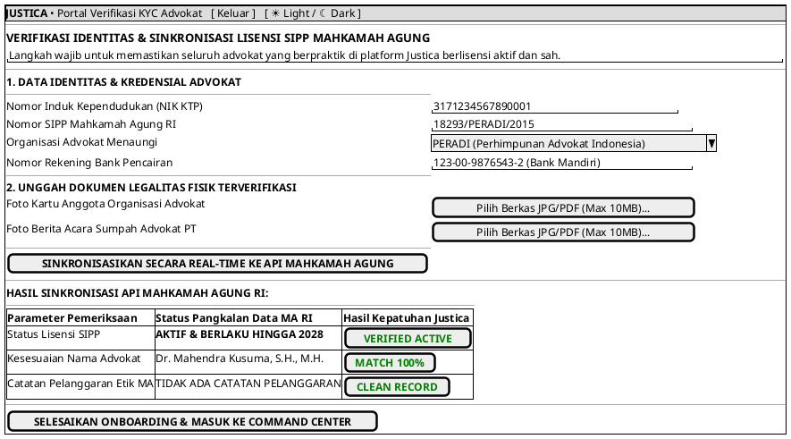

# MOCK-J-AD-01B [CLEAR]: Portal Verifikasi KYC & Sinkronisasi Lisensi SIPP Mahkamah Agung Justica

## 1. METADATA SPESIFIKASI (PRODUCT UI EDITION)
| Atribut | Nilai Spesifikasi |
| :--- | :--- |
| **ID Mockup** | `MOCK-J-AD-01B` |
| **Nama Halaman** | Portal Onboarding, Verifikasi KYC, & Sinkronisasi Lisensi SIPP Advokat |
| **Gaya Desain (*Design System*)** | **Professional Corporate Slate UI** (*Light / Dark Mode Ready*) |
| **Aktor Target** | Mitra Advokat Berlisensi Mahkamah Agung |
| **Ref. Use Case** | `J-UC19` |

---

## 2. DIAGRAM WIREFRAME BERSIH (END-USER UI SALTWIREFRAME)

