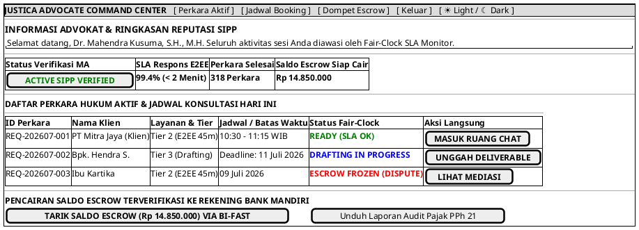

# MOCK-J-AD-02A [CLEAR]: Command Center & Dasbor Manajemen Perkara Advokat Justica

## 1. METADATA SPESIFIKASI (PRODUCT UI EDITION)
| Atribut | Nilai Spesifikasi |
| :--- | :--- |
| **ID Mockup** | `MOCK-J-AD-02A` |
| **Nama Halaman** | Command Center Advokat, Fair-Clock SLA Monitor, & Saldo Escrow |
| **Gaya Desain (*Design System*)** | **Professional Corporate Slate UI** (*Light / Dark Mode Ready*) |
| **Aktor Target** | Mitra Advokat Berlisensi Mahkamah Agung |
| **Ref. Use Case** | `J-UC03` (`ST-J-05`), `J-UC04` (`ST-J-08`), `J-UC10` (`ST-J-09`), `J-UC18` (`ST-J-16`) |

---

## 2. DIAGRAM WIREFRAME BERSIH (END-USER UI SALTWIREFRAME)

