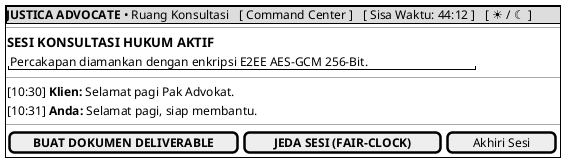

# MOCK-J-AD-04 [CLEAR]: Ruang Konsultasi Advokat E2EE Justica

## 1. METADATA SPESIFIKASI (PRODUCT UI EDITION)
| Atribut | Nilai Spesifikasi |
| :--- | :--- |
| **ID Mockup** | `MOCK-J-AD-04` |
| **Nama Halaman** | Ruang Konsultasi Advokat (`advocate.justica.id/room`) |
| **Gaya Desain (*Design System*)** | **Professional Corporate Slate UI** (*Light / Dark Mode Ready*) |
| **Aktor Target** | Mitra Advokat Berlisensi Mahkamah Agung |
| **Ref. Use Case** | `J-UC04` (`ST-J-08`), `J-UC10` (`ST-J-09`) |

---

## 2. DIAGRAM WIREFRAME BERSIH (END-USER UI SALTWIREFRAME)

---

## 3. SPESIFIKASI KONTROL FAIR-CLOCK & ATURAN JEDA WAKTU 3 LAPIS (SLA GUARDRAILS)
1. **Otoritas Ganda Jeda Waktu (*Dual Pause Authority*):**
   * Baik **Mitra Advokat (`AD-04`)** maupun **Klien (`CL-04`)** berwenang mengaktifkan tombol `[ JEDA SESI (FAIR-CLOCK) ]` untuk menghentikan sementara hitung mundur arloji konsultasi.
   * **Advokat** menggunakan fitur jeda secara proaktif saat meninjau lampiran kontrak/bukti hukum Klien mendalam agar kuota waktu berbayar Klien tidak tergerus sia-sia (*SLA Fairness & Anti-Malpractice Protection*).
   * **Klien** menggunakan fitur jeda saat membutuhkan waktu untuk mencari dokumen fisik atau mempersiapkan data internal.
2. **Aturan 3 Lapis Pengaman Pembatasan Jeda (*3-Layer SLA Guardrails*):**
   * **Lapis 1 (Batas Maksimal Jeda per Kejadian - 15 Menit):** Setiap aktivasi *Pause Clock* memiliki batas waktu maksimal **15 menit**. Jika melebihi 15 menit tanpa ditekan tombol `[ Lanjutkan Sesi ]`, sistem **secara otomatis melanjutkan penghitungan waktu (*Auto-Resume Clock*)** dan mengirimkan alarm visual/audio E2EE kepada kedua pihak.
   * **Lapis 2 (Batas Akumulasi Jeda per Sesi - 30 Menit):** Dalam 1 sesi konsultasi 45 menit, total durasi akumulasi jeda maksimal adalah **30 menit** (maksimal 2 kali aktivasi jeda @ 15 menit) guna mencegah pemekaran sesi yang mengganggu antrean reservasi slot berikutnya (`AD-03`).
   * **Lapis 3 (Protokol Abandonment & Resolusi Darurat):**
     * Jika Advokat menghilang (*ghosting/AFK*) saat status jeda $> 15$ menit pasca *Auto-Resume*, Klien dapat memicu klaim *Refund 100%* atau lapor sengketa darurat ke Pusat Mediasi (`ADM-02`).
     * Jika Klien tidak merespons hingga arloji habis (`00:00`), sesi ditutup normal (*Normal Timeout*) dan Advokat berhak mencairkan honor 100% (`AD-06`).

