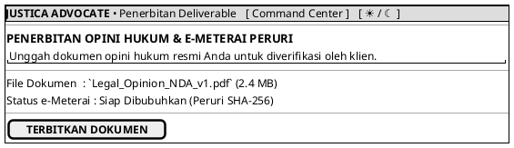

# MOCK-J-AD-05 [CLEAR]: Penerbitan Deliverable & e-Meterai Justica

## 1. METADATA SPESIFIKASI (PRODUCT UI EDITION)
| Atribut | Nilai Spesifikasi |
| :--- | :--- |
| **ID Mockup** | `MOCK-J-AD-05` |
| **Nama Halaman** | Penerbitan Opini Hukum (`advocate.justica.id/deliverable`) |
| **Gaya Desain (*Design System*)** | **Professional Corporate Slate UI** (*Light / Dark Mode Ready*) |
| **Aktor Target** | Mitra Advokat Berlisensi Mahkamah Agung |
| **Ref. Use Case** | `J-UC12` (`ST-J-12`), `J-UC14` (`ST-J-12`) |

---

## 2. DIAGRAM WIREFRAME BERSIH (END-USER UI SALTWIREFRAME)

