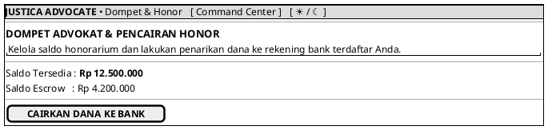

# MOCK-J-AD-06 [CLEAR]: Dompet Advokat & Pencairan Honor Justica

## 1. METADATA SPESIFIKASI (PRODUCT UI EDITION)
| Atribut | Nilai Spesifikasi |
| :--- | :--- |
| **ID Mockup** | `MOCK-J-AD-06` |
| **Nama Halaman** | Dompet Advokat (`advocate.justica.id/wallet`) |
| **Gaya Desain (*Design System*)** | **Professional Corporate Slate UI** (*Light / Dark Mode Ready*) |
| **Aktor Target** | Mitra Advokat Berlisensi Mahkamah Agung |
| **Ref. Use Case** | `J-UC05` (`ST-J-07`), `J-UC19` (`ST-J-17`) |

---

## 2. DIAGRAM WIREFRAME BERSIH (END-USER UI SALTWIREFRAME)

