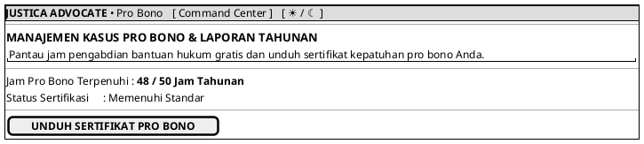

# MOCK-J-AD-07 [CLEAR]: Manajemen Pro Bono & Laporan Advokat Justica

## 1. METADATA SPESIFIKASI (PRODUCT UI EDITION)
| Atribut | Nilai Spesifikasi |
| :--- | :--- |
| **ID Mockup** | `MOCK-J-AD-07` |
| **Nama Halaman** | Manajemen Pro Bono (`advocate.justica.id/probono`) |
| **Gaya Desain (*Design System*)** | **Professional Corporate Slate UI** (*Light / Dark Mode Ready*) |
| **Aktor Target** | Mitra Advokat Berlisensi Mahkamah Agung |
| **Ref. Use Case** | `J-UC15` (`ST-J-13`), `J-UC20` (`ST-J-18`) |

---

## 2. DIAGRAM WIREFRAME BERSIH (END-USER UI SALTWIREFRAME)

