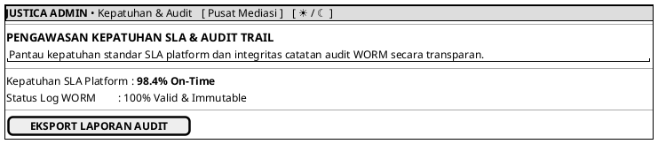

# MOCK-J-ADM-01 [CLEAR]: Portal Admin Kepatuhan SLA & Audit Justica

## 1. METADATA SPESIFIKASI (PRODUCT UI EDITION)
| Atribut | Nilai Spesifikasi |
| :--- | :--- |
| **ID Mockup** | `MOCK-J-ADM-01` |
| **Nama Halaman** | Kepatuhan SLA & Audit (`admin.justica.id/compliance`) |
| **Gaya Desain (*Design System*)** | **Professional Corporate Slate UI** (*Light / Dark Mode Ready*) |
| **Aktor Target** | Administrator Kepatuhan Justica |
| **Ref. Use Case** | `J-UC08` (`ST-J-10`), `J-UC11` (`ST-J-11`) |

---

## 2. DIAGRAM WIREFRAME BERSIH (END-USER UI SALTWIREFRAME)

