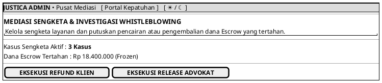

# MOCK-J-ADM-02 [CLEAR]: Pusat Mediasi & Whistleblowing Admin Justica

## 1. METADATA SPESIFIKASI (PRODUCT UI EDITION)
| Atribut | Nilai Spesifikasi |
| :--- | :--- |
| **ID Mockup** | `MOCK-J-ADM-02` |
| **Nama Halaman** | Pusat Mediasi Sengketa (`admin.justica.id/dispute-center`) |
| **Gaya Desain (*Design System*)** | **Professional Corporate Slate UI** (*Light / Dark Mode Ready*) |
| **Aktor Target** | Dewan Mediator & Administrator Kepatuhan Justica |
| **Ref. Use Case** | `J-UC15`, `J-UC21` |

---

## 2. DIAGRAM WIREFRAME BERSIH (END-USER UI SALTWIREFRAME)

