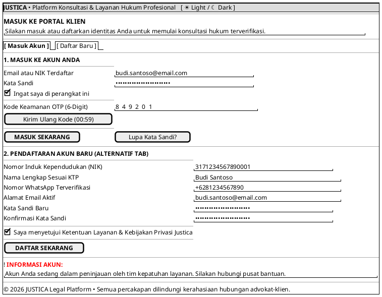

# MOCK-J-CL-01 [CLEAR]: Portal Registrasi & Login Klien Hukum Justica

## 1. METADATA SPESIFIKASI (PRODUCT UI EDITION)
| Atribut | Nilai Spesifikasi |
| :--- | :--- |
| **ID Mockup** | `MOCK-J-CL-01` |
| **Nama Halaman** | Portal Registrasi & Autentikasi Klien Hukum Justica |
| **Gaya Desain (*Design System*)** | **Professional Corporate Slate UI** (*Light / Dark Mode Ready*) |
| **Aktor Target** | Klien Hukum (*Client*) |
| **Ref. Use Case** | `J-UC01` (`ST-J-01`), `J-UC02` (`ST-J-02`) |

---

## 2. DIAGRAM WIREFRAME BERSIH (END-USER UI SALTWIREFRAME)

---

## 3. SPESIFIKASI INTERAKSI PENGGUNA (*USER EXPERIENCE FLOW*)
1. **Pemisahan Tab Masuk & Daftar:** Pengguna dapat beralih dengan mulus antara form masuk akun dan pendaftaran baru.
2. **Verifikasi Dua Langkah (OTP):** Kode keamanan dikirimkan ke nomor WhatsApp atau email pengguna demi kenyamanan dan perlindungan akun.
3. **Pesan Privasi & Kerahasiaan:** Menjamin rasa aman pengguna tanpa menampilkan jargon teknis yang rumit.
