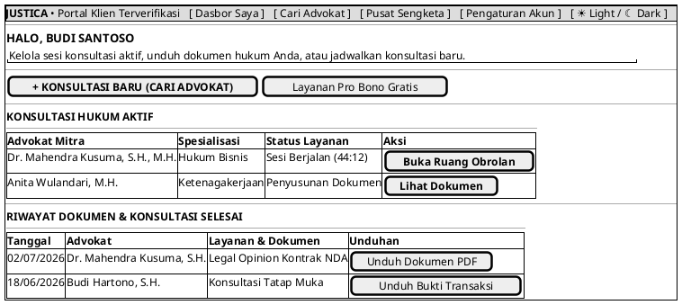

# MOCK-J-CL-02A [CLEAR]: Dasbor Utama Klien & Riwayat Perkara Justica

## 1. METADATA SPESIFIKASI (PRODUCT UI EDITION)
| Atribut | Nilai Spesifikasi |
| :--- | :--- |
| **ID Mockup** | `MOCK-J-CL-02A` |
| **Nama Halaman** | Dasbor Saya (`client.justica.id/dashboard`) |
| **Gaya Desain (*Design System*)** | **Professional Corporate Slate UI** (*Light / Dark Mode Ready*) |
| **Aktor Target** | Klien Hukum |
| **Ref. Use Case** | `J-UC03` (`ST-J-05`), `J-UC04` (`ST-J-08`), `J-UC12` (`ST-J-12`), `J-UC14` (`ST-J-12`) |

---

## 2. DIAGRAM WIREFRAME BERSIH (END-USER UI SALTWIREFRAME)

---

## 3. SPESIFIKASI PENGALAMAN PENGGUNA (*UX FLOW*)
1. **Ringkas & Fokus:** Menampilkan langsung konsultasi yang membutuhkan tindakan pengguna di bagian atas.
2. **Arsip Terpusat:** Seluruh dokumen hukum tersimpan rapi dan dapat diunduh kapan saja.
