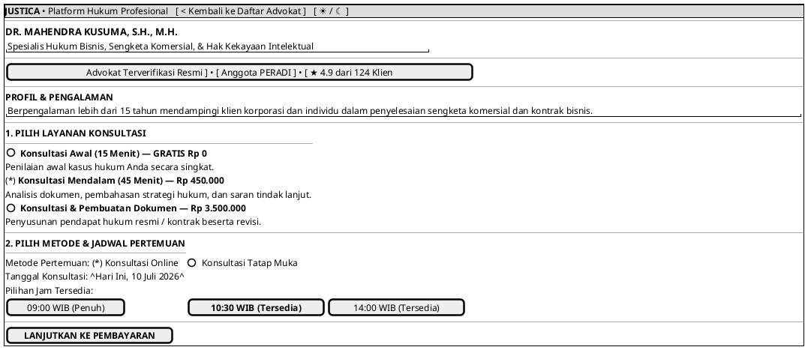

# MOCK-J-CL-02B [CLEAR]: Profil Detail Advokat & Booking Jadwal Justica

## 1. METADATA SPESIFIKASI (PRODUCT UI EDITION)
| Atribut | Nilai Spesifikasi |
| :--- | :--- |
| **ID Mockup** | `MOCK-J-CL-02B` |
| **Nama Halaman** | Profil Advokat & Pemilihan Jadwal (`client.justica.id/advocates/mahendra-kusuma`) |
| **Gaya Desain (*Design System*)** | **Professional Corporate Slate UI** (*Light / Dark Mode Ready*) |
| **Aktor Target** | Klien Hukum |
| **Ref. Use Case** | `J-UC03` (`ST-J-05`) |

---

## 2. DIAGRAM WIREFRAME BERSIH (END-USER UI SALTWIREFRAME)

---

## 3. SPESIFIKASI PENGALAMAN PENGGUNA (*UX FLOW*)
1. **Kejelasan Informasi:** Menampilkan profil lengkap serta rincian biaya yang terjamin tanpa ada biaya tersembunyi.
