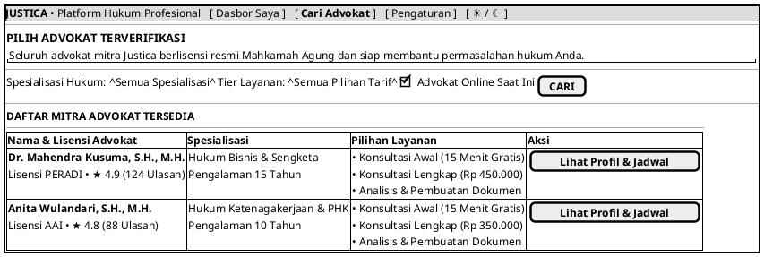

# MOCK-J-CL-02 [CLEAR]: Katalog Advokat & Direktori Layanan Justica

## 1. METADATA SPESIFIKASI (PRODUCT UI EDITION)
| Atribut | Nilai Spesifikasi |
| :--- | :--- |
| **ID Mockup** | `MOCK-J-CL-02` |
| **Nama Halaman** | Direktori Advokat (`client.justica.id/advocates`) |
| **Gaya Desain (*Design System*)** | **Professional Corporate Slate UI** (*Light / Dark Mode Ready*) |
| **Aktor Target** | Klien Hukum |
| **Ref. Use Case** | `J-UC03` |

---

## 2. DIAGRAM WIREFRAME BERSIH (END-USER UI SALTWIREFRAME)

---

## 3. SPESIFIKASI PENGALAMAN PENGGUNA (*UX FLOW*)
1. **Pilihan Transparan:** Klien dapat membandingkan keahlian, pengalaman, dan tarif setiap advokat dengan transparan sebelum memesan jadwal.
