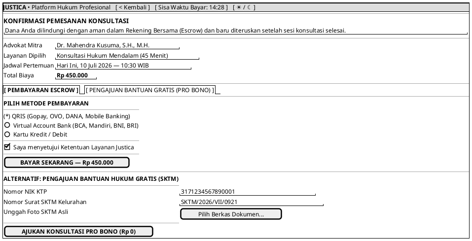

# MOCK-J-CL-03 [CLEAR]: Checkout Pembayaran & Pengajuan Pro Bono Justica

## 1. METADATA SPESIFIKASI (PRODUCT UI EDITION)
| Atribut | Nilai Spesifikasi |
| :--- | :--- |
| **ID Mockup** | `MOCK-J-CL-03` |
| **Nama Halaman** | Checkout Layanan (`client.justica.id/checkout`) |
| **Gaya Desain (*Design System*)** | **Professional Corporate Slate UI** (*Light / Dark Mode Ready*) |
| **Aktor Target** | Klien Hukum |
| **Ref. Use Case** | `J-UC05`, `J-UC15` |

---

## 2. DIAGRAM WIREFRAME BERSIH (END-USER UI SALTWIREFRAME)

---

## 3. SPESIFIKASI PENGALAMAN PENGGUNA (*UX FLOW*)
1. **Perlindungan Klien:** Menegaskan jaminan keamanan dana Escrow untuk meningkatkan kepercayaan pengguna saat pembayaran.
