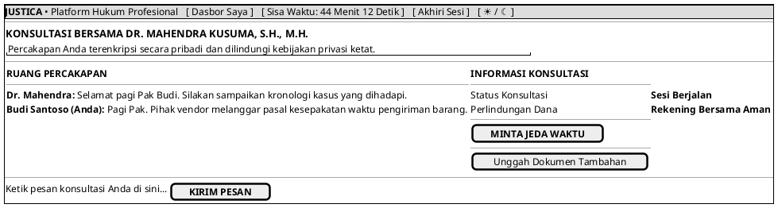

# MOCK-J-CL-04 [CLEAR]: Ruang Konsultasi Hukum Online Justica

## 1. METADATA SPESIFIKASI (PRODUCT UI EDITION)
| Atribut | Nilai Spesifikasi |
| :--- | :--- |
| **ID Mockup** | `MOCK-J-CL-04` |
| **Nama Halaman** | Ruang Konsultasi (`client.justica.id/room`) |
| **Gaya Desain (*Design System*)** | **Professional Corporate Slate UI** (*Light / Dark Mode Ready*) |
| **Aktor Target** | Klien Hukum |
| **Ref. Use Case** | `J-UC04` (`ST-J-08`), `J-UC10` (`ST-J-09`), `J-UC13` (`ST-J-10`) |

---

## 2. DIAGRAM WIREFRAME BERSIH (END-USER UI SALTWIREFRAME)

---

## 3. SPESIFIKASI KONTROL FAIR-CLOCK & ATURAN JEDA WAKTU 3 LAPIS (SLA GUARDRAILS)
1. **Otoritas Ganda Jeda Waktu (*Dual Pause Authority*):**
   * Baik **Klien (`CL-04`)** maupun **Mitra Advokat (`AD-04`)** berwenang mengaktifkan tombol `[ MINTA JEDA WAKTU (FAIR-CLOCK) ]` untuk menghentikan sementara hitung mundur arloji konsultasi.
   * **Klien** menggunakan fitur jeda saat membutuhkan waktu untuk mencari berkas fisik atau mempersiapkan data tambahan di tengah sesi.
   * **Advokat** menggunakan fitur jeda saat meninjau lampiran kontrak/bukti perkara yang rumit demi melindungi kuota waktu berbayar Klien.
2. **Aturan 3 Lapis Pengaman Pembatasan Jeda (*3-Layer SLA Guardrails*):**
   * **Lapis 1 (Batas Maksimal Jeda per Kejadian - 15 Menit):** Setiap aktivasi *Pause Clock* memiliki batas maksimal **15 menit**. Jika melebihi 15 menit tanpa dilanjutkan, sistem **secara otomatis melanjutkan penghitungan waktu (*Auto-Resume Clock*)** dan membunyikan alarm peringatan E2EE kepada kedua pihak.
   * **Lapis 2 (Batas Akumulasi Jeda per Sesi - 30 Menit):** Dalam 1 sesi konsultasi 45 menit, total durasi akumulasi jeda maksimal adalah **30 menit** (maksimal 2 kali aktivasi jeda @ 15 menit) agar sesi tidak mulur berlebihan.
   * **Lapis 3 (Protokol Abandonment & Resolusi Darurat):**
     * Jika Advokat menghilang (*ghosting/AFK*) saat status jeda $> 15$ menit pasca *Auto-Resume*, Klien berhak memicu klaim *Refund 100%* (`CL-08`) ke Pusat Mediasi (`ADM-02`).
     * Jika Klien tidak merespons hingga arloji habis (`00:00`), sesi ditutup normal (*Normal Timeout*) dan Advokat berhak menerbitkan opini hukum serta mencairkan honor 100% (`AD-06`).
