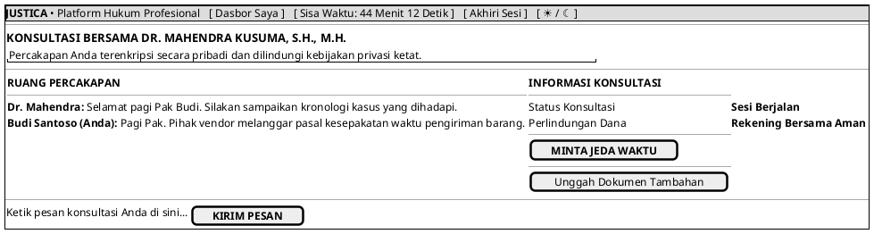

# MOCK-J-CL-04 [CLEAR]: Ruang Konsultasi Hukum Online Justica

## 1. METADATA SPESIFIKASI (PRODUCT UI EDITION)
| Atribut | Nilai Spesifikasi |
| :--- | :--- |
| **ID Mockup** | `MOCK-J-CL-04` |
| **Nama Halaman** | Ruang Konsultasi (`client.justica.id/room`) |
| **Gaya Desain (*Design System*)** | **Professional Corporate Slate UI** (*Light / Dark Mode Ready*) |
| **Aktor Target** | Klien Hukum |
| **Ref. Use Case** | `J-UC04`, `J-UC10` |

---

## 2. DIAGRAM WIREFRAME BERSIH (END-USER UI SALTWIREFRAME)

---

## 3. SPESIFIKASI PENGALAMAN PENGGUNA (*UX FLOW*)
1. **Keamanan Nyaman:** Memberikan rasa tenang bagi klien saat menyampaikan permasalahan sensitif karena pesan terenkripsi secara otomatis.
