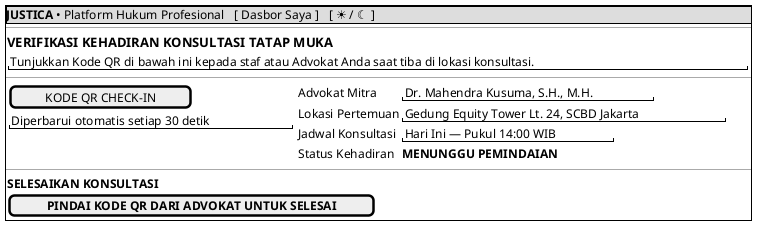

# MOCK-J-CL-05 [CLEAR]: Konsultasi Tatap Muka Resmi Justica

## 1. METADATA SPESIFIKASI (PRODUCT UI EDITION)
| Atribut | Nilai Spesifikasi |
| :--- | :--- |
| **ID Mockup** | `MOCK-J-CL-05` |
| **Nama Halaman** | Check-in Konsultasi Offline (`client.justica.id/offline-handshake`) |
| **Gaya Desain (*Design System*)** | **Professional Corporate Slate UI** (*Light / Dark Mode Ready*) |
| **Aktor Target** | Klien Hukum |
| **Ref. Use Case** | `J-UC03, J-UC04` (`ST-J-08B`) |

---

## 2. DIAGRAM WIREFRAME BERSIH (END-USER UI SALTWIREFRAME)

---

## 3. SPESIFIKASI PENGALAMAN PENGGUNA (*UX FLOW*)
1. **Verifikasi Kehadiran:** Klien tidak perlu mengisi dokumen fisik rumit, cukup memindai QR untuk memulai dan mengakhiri sesi konsultasi tatap muka.
