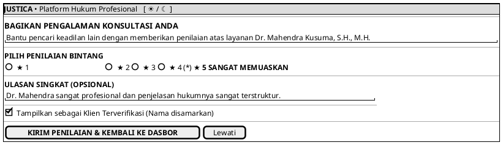

# MOCK-J-CL-07 [CLEAR]: Modal Penilaian Kinerja Advokat Justica

## 1. METADATA SPESIFIKASI (PRODUCT UI EDITION)
| Atribut | Nilai Spesifikasi |
| :--- | :--- |
| **ID Mockup** | `MOCK-J-CL-07` |
| **Nama Halaman** | Modal Penilaian Kinerja (`client.justica.id/feedback`) |
| **Gaya Desain (*Design System*)** | **Professional Corporate Slate UI** (*Light / Dark Mode Ready*) |
| **Aktor Target** | Klien Hukum |
| **Ref. Use Case** | `J-UC06` (`ST-J-14`) |

---

## 2. DIAGRAM WIREFRAME BERSIH (END-USER UI SALTWIREFRAME)

---

## 3. SPESIFIKASI PENGALAMAN PENGGUNA (*UX FLOW*)
1. **Integritas Penilaian:** Menjaga transparansi reputasi advokat melalui ulasan yang hanya dapat diberikan oleh klien terverifikasi.
