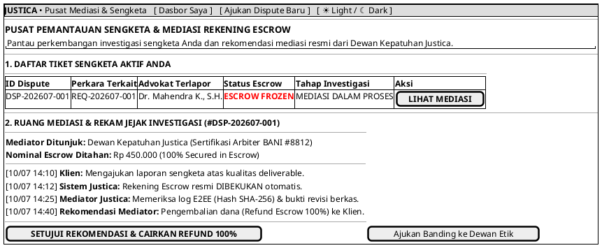

# MOCK-J-CL-09 [CLEAR]: Pusat Pemantauan Status Dispute & Mediasi Escrow Justica

## 1. METADATA SPESIFIKASI (PRODUCT UI EDITION)
| Atribut | Nilai Spesifikasi |
| :--- | :--- |
| **ID Mockup** | `MOCK-J-CL-09` |
| **Nama Halaman** | Dasbor Pusat Pemantauan Sengketa & Mediasi Escrow Klien |
| **Gaya Desain (*Design System*)** | **Professional Corporate Slate UI** (*Light / Dark Mode Ready*) |
| **Aktor Target** | Klien Hukum Terverifikasi (*Verified Legal Client*) |
| **Ref. Use Case** | `J-UC21` (`ST-J-19`) |

---

## 2. DIAGRAM WIREFRAME BERSIH (END-USER UI SALTWIREFRAME)

