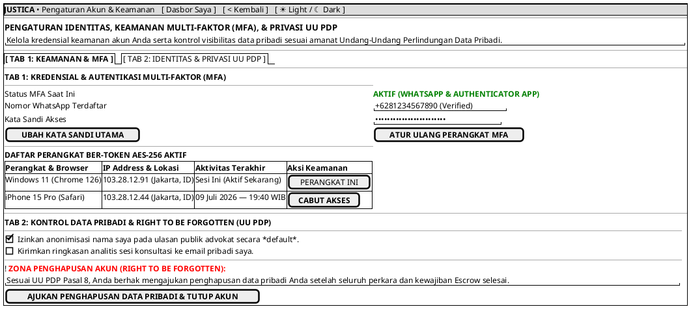

# MOCK-J-CL-10 [CLEAR]: Pengaturan Akun, Keamanan MFA, & Manajemen Privasi Klien Justica

## 1. METADATA SPESIFIKASI (PRODUCT UI EDITION)
| Atribut | Nilai Spesifikasi |
| :--- | :--- |
| **ID Mockup** | `MOCK-J-CL-10` |
| **Nama Halaman** | Pengaturan Keamanan MFA, Profil Identitas, & Privasi Data Klien |
| **Gaya Desain (*Design System*)** | **Professional Corporate Slate UI** (*Light / Dark Mode Ready*) |
| **Aktor Target** | Klien Hukum Terverifikasi (*Verified Legal Client*) |
| **Ref. Use Case** | `J-UC01` (`ST-J-01`), `J-UC02` (`ST-J-02`) |

---

## 2. DIAGRAM WIREFRAME BERSIH (END-USER UI SALTWIREFRAME)

