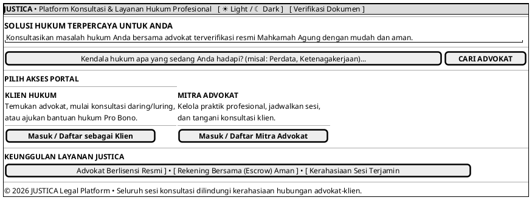

# MOCK-J-GATEWAY-01 [CLEAR]: Gerbang Utama & Pemilihan Peran Justica

## 1. METADATA SPESIFIKASI (PRODUCT UI EDITION)
| Atribut | Nilai Spesifikasi |
| :--- | :--- |
| **ID Mockup** | `MOCK-J-GATEWAY-01` |
| **Nama Halaman** | Beranda Utama Justica (`justica.id`) |
| **Gaya Desain (*Design System*)** | **Professional Corporate Slate UI** (*Light / Dark Mode Ready*) |
| **Aktor Target** | Pengguna Publik & Calon Klien |
| **Ref. Use Case** | `J-UC01`, `J-UC07` |

---

## 2. DIAGRAM WIREFRAME BERSIH (END-USER UI SALTWIREFRAME)

---

## 3. SPESIFIKASI PENGALAMAN PENGGUNA (*UX FLOW*)
1. **Navigasi Intuitif:** Pengunjung langsung memahami fungsi platform dan dapat memilih jalurnya secara tepat (Klien atau Advokat).
2. **Pencarian Cepat:** Memudahkan calon klien langsung mengetik masalah hukum sebelum mendaftar akun.
