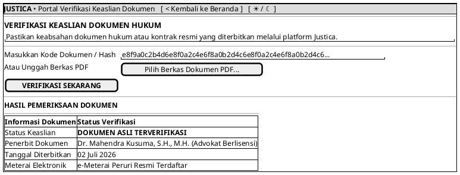

# MOCK-J-PUBLIC-VERIFY [CLEAR]: Portal Verifikasi Dokumen Justica

## 1. METADATA SPESIFIKASI (PRODUCT UI EDITION)
| Atribut | Nilai Spesifikasi |
| :--- | :--- |
| **ID Mockup** | `MOCK-J-PUBLIC-VERIFY` |
| **Nama Halaman** | Verifikasi Dokumen (`verify.justica.id`) |
| **Gaya Desain (*Design System*)** | **Professional Corporate Slate UI** (*Light / Dark Mode Ready*) |
| **Aktor Target** | Pengguna Publik |
| **Ref. Use Case** | `J-UC12`, `J-UC14` |

---

## 2. DIAGRAM WIREFRAME BERSIH (END-USER UI SALTWIREFRAME)

---

## 3. SPESIFIKASI PENGALAMAN PENGGUNA (*UX FLOW*)
1. **Kepercayaan & Keamanan:** Memberikan kepastian instan bagi instansi atau pengadilan mengenai keaslian dokumen hukum yang diterbitkan advokat Justica.
