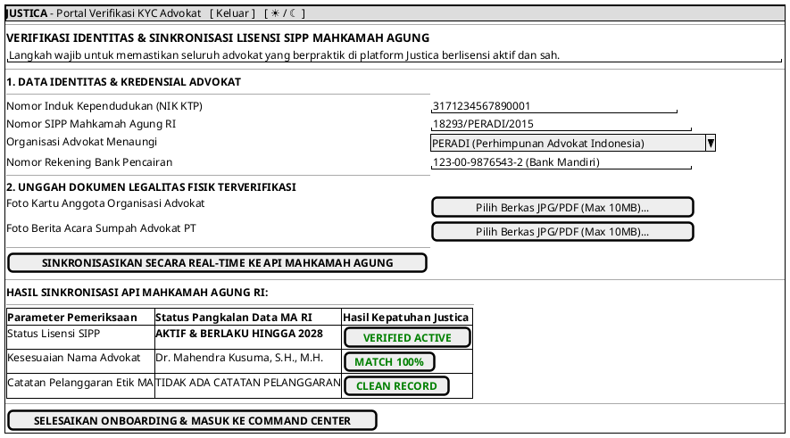

# MOCK-J-AD-01B [ORI]: Portal Verifikasi KYC & Sinkronisasi Lisensi SIPP Mahkamah Agung Justica

## 1. METADATA SPESIFIKASI (ENGINEERING EDITION)
| Atribut | Nilai Spesifikasi |
| :--- | :--- |
| **ID Mockup** | `MOCK-J-AD-01B` |
| **Nama Halaman** | Portal Onboarding, Verifikasi KYC, & Sinkronisasi Lisensi SIPP Advokat (`advocate.justica.id/kyc`) |
| **Aktor Target** | Mitra Advokat Berlisensi Mahkamah Agung |
| **Ref. Use Case** | `J-UC19` (Verifikasi KYC & Sinkronisasi SIPP Mahkamah Agung) |
| **Peta Navigasi (`from` -> `to`)** | `MOCK-J-AD-01` -> `MOCK-J-AD-01B` -> `MOCK-J-AD-02A` (Command Center) |
| **Kepatuhan Keamanan** | Automated Supreme Court API Handshake, SHA-256 Biometric Match, WORM Credential Store |

---

## 2. DIAGRAM WIREFRAME LOGIS (PLANTUML SALT)

---

## 3. KAMUS DATA & ELEMEN UI (DATA FIELD DICTIONARY)
| ID Elemen | Nama Komponen UI | Tipe Data | Wajib? | Aturan Validasi Logis & Batasan Kepatuhan |
| :--- | :--- | :--- | :---: | :--- |
| `KYC-NAV-01`| `Tombol Keluar`     | Action Button | Ya | Keluar dari sesi onboarding dan kembali ke `MOCK-J-GATEWAY-01`. |
| `KYC-NAV-02`| `Toggle Theme Mode` | Action Button | Ya | Mengubah tema visual antarmuka Light/Dark Mode di local storage. |
| `KYC-IN-01` | `Nomor NIK KTP`     | Numeric String| Ya | 16 digit numerik (`^[0-9]{16}$`) cocok dengan database Dukcapil. |
| `KYC-IN-02` | `Nomor SIPP MA`     | String        | Ya | Format resmi nomor SIPP Mahkamah Agung. |
| `KYC-SEL-01`| `Organisasi Advokat`| Dropdown      | Ya | Pilihan organisasi advokat resmi (PERADI, AAI, KAI, IKADIN). |
| `KYC-IN-03` | `Nomor Rekening`    | String        | Ya | Nomor rekening atas nama advokat yang bersangkutan untuk pencairan Escrow. |
| `KYC-UP-01` | `Foto Kartu Advokat`| File Binary   | Ya | Berkas `.jpg`/`.pdf` maksimal 10MB terenkripsi SHA-256. |
| `KYC-UP-02` | `Foto BA Sumpah PT` | File Binary   | Ya | Bukti Berita Acara Sumpah Pengadilan Tinggi (mandat UU Advokat No. 18/2003). |
| `KYC-BTN-01`| `Sinkronisasi MA`   | Action Button | Ya | Memicu panggilan API ke pangkalan data Mahkamah Agung RI. |
| `KYC-BTN-02`| `Selesaikan Onboard`| Action Button | Ya | Aktif HANYA JIKA hasil verifikasi SIPP MA = `VERIFIED ACTIVE`. |

---

## 4. MATRIKS EVENT HANDLER & TRANSISI LOGIKA
| Event Trigger | Komponen UI | Kondisi Guard (*Pre-Condition*) | Aksi Sistem (*System Response*) | Transisi Layar (*Target*) |
| :--- | :--- | :--- | :--- | :--- |
| `onClick` | Tombol `[ SINKRONISASIKAN KE API MA ]`| Seluruh field identitas & berkas terisi | Kirim request ke endpoint API SIPP MA, tampilkan tabel status verifikasi. | Tetap di `MOCK-J-AD-01B` |
| `onClick` | Tombol `[ SELESAIKAN ONBOARDING ]`    | `SIPP Status == VERIFIED ACTIVE`| Simpan sertifikat verifikasi KYC advokat, aktifkan akun advokat. | -> `MOCK-J-AD-02A` (Command Center) |
| `onClick` | Tombol `[ Keluar ]`                   | Tidak ada | Batalkan sesi KYC dan kembali ke halaman gerbang utama. | -> `MOCK-J-GATEWAY-01` |
| `onClick` | Tombol `[ ☀ / ☾ Mode ]`               | Tidak ada | Mengganti tema visual antarmuka Light/Dark Mode. | Tetap di `MOCK-J-AD-01B` |

---

## 5. KONTRAK INTEGRASI API & DATA BINDING (*API BINDING CONTRACT*)
| Aksi UI | HTTP Method & Endpoint | Payload Request JSON | Struktur Response JSON |
| :--- | :--- | :--- | :--- |
| Sinkronisasi SIPP MA | `POST /api/v2/advocate/kyc/verify-sipp` | `{"nik": "3171...", "sipp_number": "18293/PERADI/2015", "organization": "PERADI"}` | `200 OK: {"status": "VERIFIED_ACTIVE", "advocate_name": "Dr. Mahendra Kusuma", "expiry_year": 2028}` |

---

## 6. MATRIKS PENANGANAN ERROR & CATATAN ARSITEKTUR TEKNIS
| Kode HTTP / Error | Skenario Pemicu Kegagalan | Pesan UI ke Pengguna (*User-Facing Message*) | Mekanisme Pemulihan / Fallback |
| :--- | :--- | :--- | :--- |
| `404 SIPP Not Found`| Nomor SIPP tidak terdaftar di database MA | `"Verifikasi Gagal: Nomor SIPP tidak ditemukan pada database Mahkamah Agung."` | Advokat diminta memeriksa kembali penulisan nomor atau mengunggah surat keterangan MA. |

### Catatan Arsitektur Teknis:
1. **Automated Supreme Court Verification:** Sinkronisasi API memastikan bahwa tidak ada pihak yang dapat mengaku sebagai advokat di platform Justica tanpa memiliki Berita Acara Sumpah Pengadilan Tinggi yang sah.
2. **Bank Account Verification:** Rekening pencairan Escrow harus memiliki nama pemilik yang sama persis 100% dengan nama pada SIPP MA dan KTP untuk mencegah pencucian uang (*AML Compliance*).
