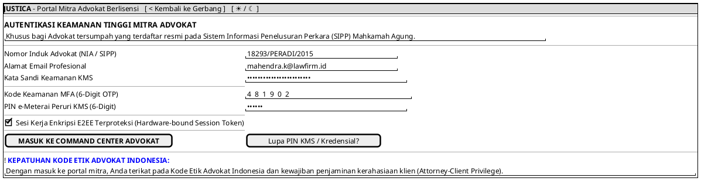

# MOCK-J-AD-01 [ORI]: Portal Login & Autentikasi Mitra Advokat Justica

## 1. METADATA SPESIFIKASI (ENGINEERING EDITION)
| Atribut | Nilai Spesifikasi |
| :--- | :--- |
| **ID Mockup** | `MOCK-J-AD-01` |
| **Nama Halaman** | Portal Autentikasi & Keamanan Mitra Advokat (`advocate.justica.id/login`) |
| **Aktor Target** | Mitra Advokat Berlisensi Mahkamah Agung & SIPP PERADI/AAI/KAI |
| **Ref. Use Case** | `J-UC18` (Autentikasi Advokat MFA & e-Meterai PIN) |
| **Peta Navigasi (`from` -> `to`)** | `MOCK-J-GATEWAY-01` -> `MOCK-J-AD-01` -> `MOCK-J-AD-01B` (Verifikasi KYC SIPP), `MOCK-J-AD-02A` (Command Center) |
| **Kepatuhan Keamanan** | Hardware Token / FIDO2 Key ready, Mandatory MFA OTP + 6-Digit PIN e-Meterai KMS, Rate Limit 3 attempts/15m |

---

## 2. DIAGRAM WIREFRAME LOGIS (PLANTUML SALT)

---

## 3. KAMUS DATA & ELEMEN UI (DATA FIELD DICTIONARY)
| ID Elemen | Nama Komponen UI | Tipe Data | Wajib? | Aturan Validasi Logis & Batasan Kepatuhan |
| :--- | :--- | :--- | :---: | :--- |
| `AD01-NAV-01`| `Kembali ke Gerbang`| Action Button | Ya | Kembali ke gerbang utama `MOCK-J-GATEWAY-01`. |
| `AD01-NAV-02`| `Toggle Theme Mode` | Action Button | Ya | Mengubah tema visual antarmuka Light/Dark Mode di local storage. |
| `AD01-IN-01` | `Nomor SIPP / NIA`  | String        | Ya | Format nomor lisensi resmi advokat terdaftar di Mahkamah Agung. |
| `AD01-IN-02` | `Email Profesional` | Email String  | Ya | Alamat email korporat/profesional advokat yang terverifikasi. |
| `AD01-IN-03` | `Kata Sandi KMS`    | Password      | Ya | Minimal 12 karakter kompleks dengan perlindungan enkripsi KMS. |
| `AD01-IN-04` | `Kode MFA (6-Digit)`| Numeric String| Ya | Tepat 6 digit angka TOTP yang dikirim ke aplikasi autentikator. |
| `AD01-IN-05` | `PIN e-Meterai KMS` | Password      | Ya | Tepat 6 digit PIN rahasia untuk otorisasi penandatanganan dokumen Peruri. |
| `AD01-CHK-01`| `Hardware Token Lock`| Boolean      | Tidak | Pengikatan sesi ke sidik jari perangkat keras advokat. |
| `AD01-BTN-01`| `Masuk Command Ctr` | Action Button | Ya | Memverifikasi kredensial berlapis dan mengalihkan ke Command Center `AD-02A`. |
| `AD01-BTN-02`| `Lupa PIN / Kredensial`| Action Button| Ya | Membuka prosedur reset khusus advokat dengan verifikasi ke organisasi profesi. |

---

## 4. MATRIKS EVENT HANDLER & TRANSISI LOGIKA
| Event Trigger | Komponen UI | Kondisi Guard (*Pre-Condition*) | Aksi Sistem (*System Response*) | Transisi Layar (*Target*) |
| :--- | :--- | :--- | :--- | :--- |
| `onClick` | Tombol `[ MASUK COMMAND CENTER ]`| Kredensial, OTP, & PIN valid | Verifikasi status SIPP MA secara real-time, terbitkan JWT advokat berprivilege. | -> `MOCK-J-AD-02A` (Command Center) |
| `onClick` | Tombol `[ Lupa PIN / Kredensial? ]`| Tidak ada | Alihkan ke alur verifikasi ulang identitas advokat melalui email SIPP terdaftar. | Modal Pemulihan Advokat |
| `onClick` | Tombol `[ < Kembali ke Gerbang ]`  | Tidak ada | Kembali ke gerbang utama platform Justica. | -> `MOCK-J-GATEWAY-01` |
| `onClick` | Tombol `[ ☀ / ☾ Mode ]`            | Tidak ada | Mengganti tema visual antarmuka Light/Dark Mode. | Tetap di `MOCK-J-AD-01` |

---

## 5. KONTRAK INTEGRASI API & DATA BINDING (*API BINDING CONTRACT*)
| Aksi UI | HTTP Method & Endpoint | Payload Request JSON | Struktur Response JSON |
| :--- | :--- | :--- | :--- |
| Login Advokat KMS | `POST /api/v2/auth/advocate/login-mfa` | `{"sipp_number": "18293/PERADI/2015", "password": "...", "otp_code": "481902", "emeterai_pin": "..."}` | `200 OK: {"access_token": "jwt...", "advocate": {"id": "AD-101", "sipp_status": "ACTIVE_VERIFIED"}}` |

---

## 6. MATRIKS PENANGANAN ERROR & CATATAN ARSITEKTUR TEKNIS
| Kode HTTP / Error | Skenario Pemicu Kegagalan | Pesan UI ke Pengguna (*User-Facing Message*) | Mekanisme Pemulihan / Fallback |
| :--- | :--- | :--- | :--- |
| `403 SIPP Suspended`| Status SIPP advokat dinonaktifkan/ditangguhkan oleh MA | `"Akses ditolak: Lisensi SIPP Anda tercatat tidak aktif pada pangkalan data Mahkamah Agung."` | Akses ke portal advokat diblokir total hingga lisensi diperbarui. |

### Catatan Arsitektur Teknis:
1. **Dual-PIN KMS Security:** Advokat tidak hanya memasukkan kata sandi akun, tetapi juga PIN e-Meterai KMS untuk memastikan kesiapan penandatanganan dokumen secara legal.
2. **Real-time SIPP Revocation Check:** Setiap kali advokat login, sistem memeriksa API Mahkamah Agung untuk memastikan bahwa izin praktik advokat tidak sedang dicabut.
