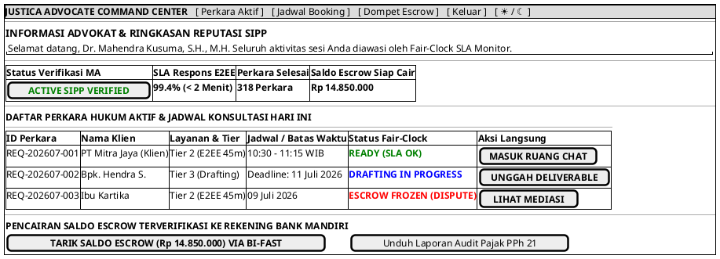

# MOCK-J-AD-02A [ORI]: Command Center & Dasbor Manajemen Perkara Advokat Justica

## 1. METADATA SPESIFIKASI (ENGINEERING EDITION)
| Atribut | Nilai Spesifikasi |
| :--- | :--- |
| **ID Mockup** | `MOCK-J-AD-02A` |
| **Nama Halaman** | Command Center Advokat, Fair-Clock SLA Monitor, & Saldo Escrow (`advocate.justica.id/dashboard`) |
| **Aktor Target** | Mitra Advokat Berlisensi Mahkamah Agung |
| **Ref. Use Case** | `J-UC20` (Manajemen Perkara Aktif & Monitoring SLA Fair-Clock) |
| **Peta Navigasi (`from` -> `to`)** | `MOCK-J-AD-01` -> `MOCK-J-AD-02A` -> `MOCK-J-CL-04` (Masuk Ruang E2EE), `MOCK-J-CL-06` (Unggah Deliverable), `MOCK-J-CL-09` (Lihat Mediasi), `MOCK-J-GATEWAY-01` (Keluar) |
| **Kepatuhan Keamanan** | Hardware Token Session Lock, Realtime Fair-Clock SLA Penalty Guard, Escrow Payout Ledger |

---

## 2. DIAGRAM WIREFRAME LOGIS (PLANTUML SALT)

---

## 3. KAMUS DATA & ELEMEN UI (DATA FIELD DICTIONARY)
| ID Elemen | Nama Komponen UI | Tipe Data | Wajib? | Aturan Validasi Logis & Batasan Kepatuhan |
| :--- | :--- | :--- | :---: | :--- |
| `CMD-NAV-01` | `Tab Perkara Aktif` | Navigation Link | Ya | Menampilkan daftar seluruh perkara yang sedang berjalan. |
| `CMD-NAV-02` | `Tab Jadwal Booking`| Navigation Link | Ya | Menampilkan kalender ketersediaan slot waktu advokat. |
| `CMD-NAV-03` | `Tab Dompet Escrow` | Navigation Link | Ya | Menampilkan rincian saldo tertahan dan saldo siap cair. |
| `CMD-NAV-04` | `Tombol Keluar`     | Action Button   | Ya | Menghapus token sesi advokat dan kembali ke gerbang utama `MOCK-J-GATEWAY-01`. |
| `CMD-NAV-05` | `Toggle Theme Mode` | Action Button   | Ya | Mengubah tema visual antarmuka Light/Dark Mode di local storage. |
| `CMD-TBL-01` | `Tabel Perkara Aktif`| Data Grid      | Ya | Menampilkan daftar transaksi klien dengan pemantauan batas SLA Fair-Clock. |
| `CMD-ACT-01` | `Masuk Ruang Chat`  | Action Button   | Ya | Membuka saluran koneksi obrolan E2EE `MOCK-J-CL-04` dengan mode advokat. |
| `CMD-ACT-02` | `Unggah Deliverable`| Action Button   | Ya | Membuka portal pengunggahan dokumen legal opinion/draf `MOCK-J-CL-06`. |
| `CMD-ACT-03` | `Lihat Mediasi`     | Action Button   | Ya | Terhubung dengan ruang mediasi sengketa Escrow `MOCK-J-CL-09`. |
| `CMD-BTN-01` | `Tarik Saldo Escrow`| Action Button   | Ya | Menerbitkan instruksi pencairan BI-FAST ke rekening advokat terverifikasi KYC. |
| `CMD-BTN-02` | `Unduh Laporan PPh 21`| Action Button | Ya | Mengunduh bukti potong pajak penghasilan profesi advokat dalam format PDF. |

---

## 4. MATRIKS EVENT HANDLER & TRANSISI LOGIKA
| Event Trigger | Komponen UI | Kondisi Guard (*Pre-Condition*) | Aksi Sistem (*System Response*) | Transisi Layar (*Target*) |
| :--- | :--- | :--- | :--- | :--- |
| `onClick` | Tombol `[ MASUK RUANG CHAT ]`  | Waktu sesi aktif | Buka koneksi E2EE WebRTC/WebSocket dengan identitas Advokat. | -> `MOCK-J-CL-04` (Chat Room E2EE) |
| `onClick` | Tombol `[ UNGGAH DELIVERABLE ]`| Status perkara `DRAFTING`| Buka panel pengunggahan dokumen ber-meterai elektronik KMS. | -> `MOCK-J-CL-06` (Deliverable Room) |
| `onClick` | Tombol `[ LIHAT MEDIASI ]`     | Status perkara `FROZEN`  | Membuka kronologi investigasi sengketa & rekomendasi mediator. | -> `MOCK-J-CL-09` (Pusat Mediasi) |
| `onClick` | Tombol `[ TARIK SALDO ESCROW ]`| `Saldo Siap Cair > Rp 50.000`| Eksekusi transfer otomatis BI-FAST, buat catatan mutasi finansial. | Modal Konfirmasi Penarikan |
| `onClick` | Tombol `[ Unduh Laporan PPh 21 ]`| Tidak ada | Generate dokumen PDF bukti potong pajak resmi yang ditandatangani platform. | Unduhan PDF |
| `onClick` | Header `[ Keluar ]`            | Tidak ada | Akhiri sesi advokat dan alihkan ke gerbang platform. | -> `MOCK-J-GATEWAY-01` |
| `onClick` | Tombol `[ ☀ / ☾ Mode ]`        | Tidak ada | Mengganti tema visual antarmuka Light/Dark Mode. | Tetap di `MOCK-J-AD-02A` |

---

## 5. KONTRAK INTEGRASI API & DATA BINDING (*API BINDING CONTRACT*)
| Aksi UI | HTTP Method & Endpoint | Payload Request JSON | Struktur Response JSON |
| :--- | :--- | :--- | :--- |
| Pencairan Saldo Escrow | `POST /api/v2/advocate/payout/withdraw` | `{"advocate_id": "AD-101", "amount": 14850000, "destination_bank": "MANDIRI"}` | `200 OK: {"payout_id": "PYT-8812", "status": "TRANSFERRED_BI_FAST", "net_received": 14850000}` |

---

## 6. MATRIKS PENANGANAN ERROR & CATATAN ARSITEKTUR TEKNIS
| Kode HTTP / Error | Skenario Pemicu Kegagalan | Pesan UI ke Pengguna (*User-Facing Message*) | Mekanisme Pemulihan / Fallback |
| :--- | :--- | :--- | :--- |
| `423 Escrow Frozen` | Ada perkara dalam investigasi dispute | `"Penarikan ditunda sementara: Terdapat perkara dalam proses mediasi sengketa."` | Advokat diarahkan untuk menyelesaikan mediasi pada tiket dispute terkait. |

### Catatan Arsitektur Teknis:
1. **Real-time Fair-Clock SLA Monitor:** Jika advokat terlambat merespons klien melebihi batas toleransi SLA Fair-Clock (>5 menit), sistem otomatis memberi peringatan visual dan menurunkan skor reputasi.
2. **Automated PPh 21 Tax Withholding:** Setiap pencairan dana Escrow ke advokat telah menghitung dan mencatat kewajiban pajak PPh 21 secara otomatis sesuai regulasi perpajakan Republik Indonesia.
