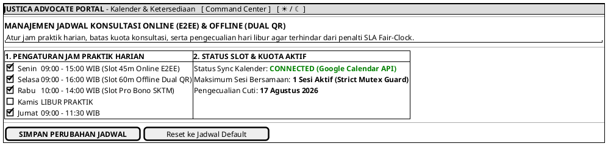

# MOCK-J-AD-03 [ORI]: Pengaturan Jadwal & Slot Ketersediaan Advokat Justica

## 1. METADATA SPESIFIKASI (ENGINEERING EDITION)
| Atribut | Nilai Spesifikasi |
| :--- | :--- |
| **ID Mockup** | `MOCK-J-AD-03` |
| **Nama Halaman** | Pengaturan Jadwal Ketersediaan & Kalender Praktik Advokat (`advocate.justica.id/schedule`) |
| **Aktor Target** | Mitra Advokat Berlisensi Mahkamah Agung & SIPP |
| **Ref. Use Case** | `J-UC03` (`ST-J-05`: Pengaturan Jadwal & Slot Ketersediaan Konsultasi Online/Offline Advokat) |
| **Peta Navigasi (`from` -> `to`)** | `MOCK-J-AD-02A` -> `MOCK-J-AD-03` -> `MOCK-J-AD-02A` (Command Center) |
| **Kepatuhan Keamanan** | Concurrency Slot Lock (Redis Mutex TTL 15m), Calendar Conflict Prevention Guard, WORM Schedule Audit |

---

## 2. DIAGRAM WIREFRAME LOGIS (PLANTUML SALT)

