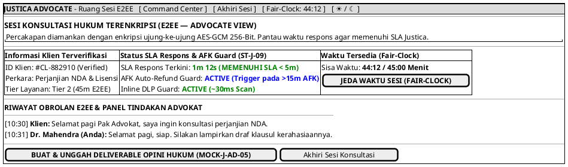

# MOCK-J-AD-04 [ORI]: Ruang Konsultasi Hukum E2EE & SLA Respons Advokat Justica

## 1. METADATA SPESIFIKASI (ENGINEERING EDITION)
| Atribut | Nilai Spesifikasi |
| :--- | :--- |
| **ID Mockup** | `MOCK-J-AD-04` |
| **Nama Halaman** | Ruang Konsultasi Advokat E2EE & SLA Respons Monitor (`advocate.justica.id/room/{id}`) |
| **Aktor Target** | Mitra Advokat Berlisensi Mahkamah Agung & SIPP |
| **Ref. Use Case** | `J-UC04` (`ST-J-08`: Konsultasi E2EE Chat/Call), `J-UC10` (`ST-J-09`: SLA Respons & AFK Auto-Refund Guard) |
| **Peta Navigasi (`from` -> `to`)** | `MOCK-J-AD-02A` -> `MOCK-J-AD-04` -> `MOCK-J-AD-05` (Buat Deliverable), `MOCK-J-AD-02A` (Command Center) |
| **Kepatuhan Keamanan** | Client-Side Signal AES-GCM Enkripsi, Inline DLP Guard (~30ms), SLA Respons Guard (<5m / <15m AFK Auto-Refund) |

---

## 2. DIAGRAM WIREFRAME LOGIS (PLANTUML SALT)

