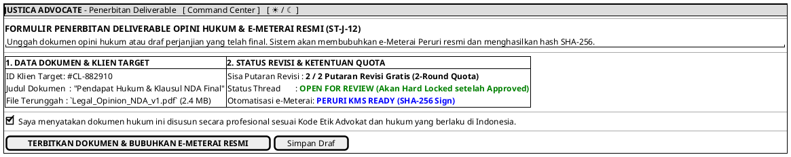

# MOCK-J-AD-05 [ORI]: Penerbitan Deliverable & Pembubuhan e-Meterai Peruri SHA-256 Justica

## 1. METADATA SPESIFIKASI (ENGINEERING EDITION)
| Atribut | Nilai Spesifikasi |
| :--- | :--- |
| **ID Mockup** | `MOCK-J-AD-05` |
| **Nama Halaman** | Penerbitan Opini Hukum & Pembubuhan e-Meterai Peruri (`advocate.justica.id/deliverable/new`) |
| **Aktor Target** | Mitra Advokat Berlisensi Mahkamah Agung & SIPP |
| **Ref. Use Case** | `J-UC12` (`ST-J-12`: Pembuatan & Verifikasi Deliverable Opini Hukum), `J-UC14` (`ST-J-12`: Pembubuhan e-Meterai Peruri SHA-256) |
| **Peta Navigasi (`from` -> `to`)** | `MOCK-J-AD-04` -> `MOCK-J-AD-05` -> `MOCK-J-AD-02A` (Command Center) |
| **Kepatuhan Keamanan** | Peruri KMS Integration, SHA-256 Digital Hash Generation, 2-Round Quota Guard, Hard Thread Lock |

---

## 2. DIAGRAM WIREFRAME LOGIS (PLANTUML SALT)

