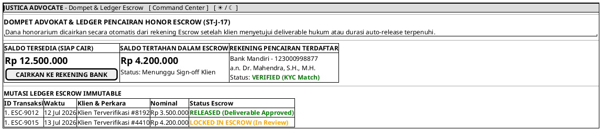

# MOCK-J-AD-06 [ORI]: Dompet Advokat & Ledger Pencairan Honor Escrow Justica

## 1. METADATA SPESIFIKASI (ENGINEERING EDITION)
| Atribut | Nilai Spesifikasi |
| :--- | :--- |
| **ID Mockup** | `MOCK-J-AD-06` |
| **Nama Halaman** | Dompet Digital Advokat & Ledger Pencairan Escrow (`advocate.justica.id/wallet`) |
| **Aktor Target** | Mitra Advokat Berlisensi Mahkamah Agung & SIPP |
| **Ref. Use Case** | `J-UC05` (`ST-J-07`: Escrow Release Ledger), `J-UC19` (`ST-J-17`: Pencairan Honor & Riwayat Penghasilan Advokat) |
| **Peta Navigasi (`from` -> `to`)** | `MOCK-J-AD-02A` -> `MOCK-J-AD-06` -> `MOCK-J-AD-02A` (Command Center) |
| **Kepatuhan Keamanan** | Automated Escrow Ledger Handshake, BI-FAST Bank Transfer KMS, MFA OTP Payout Guard |

---

## 2. DIAGRAM WIREFRAME LOGIS (PLANTUML SALT)

