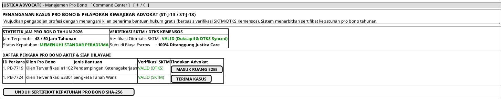

# MOCK-J-AD-07 [ORI]: Pusat Penanganan & Pelaporan Kewajiban Pro Bono Advokat Justica

## 1. METADATA SPESIFIKASI (ENGINEERING EDITION)
| Atribut | Nilai Spesifikasi |
| :--- | :--- |
| **ID Mockup** | `MOCK-J-AD-07` |
| **Nama Halaman** | Manajemen Kasus Pro Bono & Pelaporan Kegiatan Hukum (`advocate.justica.id/probono`) |
| **Aktor Target** | Mitra Advokat Berlisensi Mahkamah Agung & SIPP |
| **Ref. Use Case** | `J-UC15` (`ST-J-13`: Penanganan Kasus Pro Bono SKTM/DTKS), `J-UC20` (`ST-J-18`: Pelaporan Kewajiban Pro Bono Advokat) |
| **Peta Navigasi (`from` -> `to`)** | `MOCK-J-AD-02A` -> `MOCK-J-AD-07` -> `MOCK-J-AD-04` (Masuk Sesi Pro Bono), `MOCK-J-AD-02A` (Command Center) |
| **Kepatuhan Keamanan** | Automated SKTM/DTKS Hash Verification, WORM Pro Bono Activity Certificate |

---

## 2. DIAGRAM WIREFRAME LOGIS (PLANTUML SALT)

