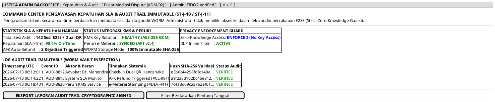

# MOCK-J-ADM-01 [ORI]: Portal Backoffice Kepatuhan SLA & Audit Trail Administrator Justica

## 1. METADATA SPESIFIKASI (ENGINEERING EDITION)
| Atribut | Nilai Spesifikasi |
| :--- | :--- |
| **ID Mockup** | `MOCK-J-ADM-01` |
| **Nama Halaman** | Command Center Kepatuhan SLA & Audit Trail Sistem (`admin.justica.id/compliance`) |
| **Aktor Target** | Administrator Kepatuhan & Auditor Internal Justica |
| **Ref. Use Case** | `J-UC08` (`ST-J-10`: Monitoring Kepatuhan SLA & Audit Trail Immuted), `J-UC11` (`ST-J-11`: Verifikasi e-Meterai & KMS Log) |
| **Peta Navigasi (`from` -> `to`)** | `MOCK-J-GATEWAY-01` -> `MOCK-J-ADM-01` -> `MOCK-J-ADM-02` (Pusat Mediasi Sengketa) |
| **Kepatuhan Keamanan** | Zero-Knowledge E2EE Privacy Guard (Metadata-Only Access), WORM Immutable SHA-256 Audit Ledger, FIDO2 Admin MFA |

---

## 2. DIAGRAM WIREFRAME LOGIS (PLANTUML SALT)

