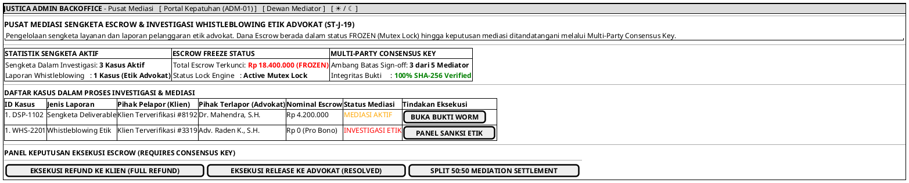

# MOCK-J-ADM-02 [ORI]: Pusat Investigasi Mediasi Sengketa Escrow & Whistleblowing Administrator Justica

## 1. METADATA SPESIFIKASI (ENGINEERING EDITION)
| Atribut | Nilai Spesifikasi |
| :--- | :--- |
| **ID Mockup** | `MOCK-J-ADM-02` |
| **Nama Halaman** | Pusat Mediasi Sengketa Layanan & Whistleblowing Etik (`admin.justica.id/dispute-center`) |
| **Aktor Target** | Dewan Mediator & Administrator Kepatuhan Justica |
| **Ref. Use Case** | `J-UC15` (`ST-J-13`), `J-UC21` (`ST-J-19`: Investigasi & Mediasi Pelanggaran Etik Advokat) |
| **Peta Navigasi (`from` -> `to`)** | `MOCK-J-ADM-01` -> `MOCK-J-ADM-02` -> `MOCK-J-ADM-01` (Kembali ke Kepatuhan) |
| **Kepatuhan Keamanan** | Multi-Party Mediator Consensus Key (3-of-5 Threshold Sign-off), Immediate Escrow Mutex Lock, WORM Evidence Decryption |

---

## 2. DIAGRAM WIREFRAME LOGIS (PLANTUML SALT)

