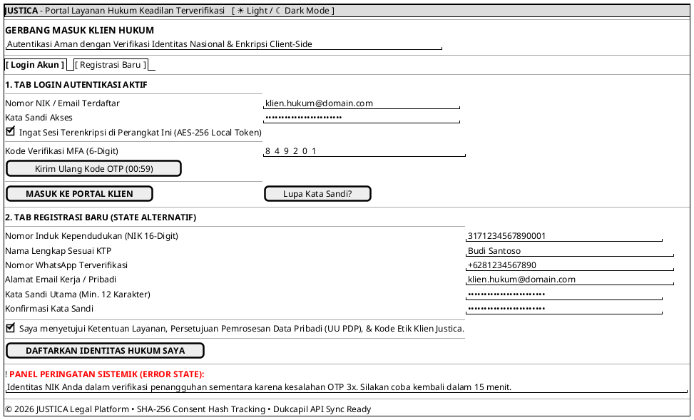

# MOCK-J-CL-01 [ORI]: Portal Registrasi & Login Klien Hukum Justica

## 1. METADATA SPESIFIKASI (ENGINEERING EDITION)
| Atribut | Nilai Spesifikasi |
| :--- | :--- |
| **ID Mockup** | `MOCK-J-CL-01` |
| **Nama Halaman** | Portal Registrasi & Autentikasi Klien Hukum Justica (`client.justica.id/login`) |
| **Aktor Target** | Klien Hukum (*Client*) |
| **Ref. Use Case** | `J-UC01` (Registrasi Akun Klien), `J-UC02` (Login Autentikasi MFA) |
| **Peta Navigasi (`from` -> `to`)** | `MOCK-J-GATEWAY-01` -> `MOCK-J-CL-01` -> `MOCK-J-CL-02A` (Dasbor Utama Klien) |
| **Kepatuhan Keamanan** | SHA-256 Consent Hash Tracking, AES-256 Local Token Storage, Mandatory MFA OTP, Rate Limit 5 attempts/15m |

---

## 2. DIAGRAM WIREFRAME LOGIS (PLANTUML SALT)

---

## 3. KAMUS DATA & ELEMEN UI (DATA FIELD DICTIONARY)
| ID Elemen | Nama Komponen UI | Tipe Data | Wajib? | Aturan Validasi Logis & Batasan Kepatuhan |
| :--- | :--- | :--- | :---: | :--- |
| `CL01-IN-01` | `Nomor NIK / Email` | String | Ya | Format email standar RFC 5322 atau NIK numeric 16 digit terverifikasi Dukcapil. |
| `CL01-IN-02` | `Kata Sandi Akses` | Password | Ya | Minimal 12 karakter (berisi kombinasi huruf besar, kecil, angka, dan simbol). |
| `CL01-IN-03` | `Kode MFA (6-Digit)` | String (Numeric) | Ya | Tepat 6 karakter numerik (`^[0-9]{6}$`), masa kedaluwarsa token 300 detik. |
| `CL01-CHK-01`| `Ingat Sesi Perangkat` | Boolean | Tidak | Nilai default `false`. Jika `true`, menerbitkan AES-256 Local Token (TTL 30 hari). |
| `CL01-IN-04` | `NIK Registrasi` | Numeric | Ya | Tepat 16 digit angka (`^[0-9]{16}$`), validasi checksum algoritma kependudukan. |
| `CL01-CHK-02`| `Consent UU PDP` | Boolean | Ya | Wajib `true` untuk submit. Memicu pembentukan `SHA-256 Consent Hash Record`. |

---

## 4. MATRIKS EVENT HANDLER & TRANSISI LOGIKA
| Event Trigger | Komponen UI | Kondisi Guard (*Pre-Condition*) | Aksi Sistem (*System Response*) | Transisi Layar (*Target*) |
| :--- | :--- | :--- | :--- | :--- |
| `onClick` | Tombol `[ MASUK KE PORTAL ]` | Form `Login` valid & `OTP` cocok | Verifikasi sesi JWT Bearer, catat IP & perangkat ke log audit WORM. | -> `MOCK-J-CL-02A` (Dasbor Klien) |
| `onClick` | Tombol `[ DAFTARKAN IDENTITAS ]` | Form `Registrasi` valid & `Consent == true` | Kirim OTP aktivasi ke WhatsApp, generate hash persetujuan SHA-256. | -> `MOCK-J-CL-01` (Tab Login OTP) |
| `onClick` | Tombol `[ Kirim Ulang Kode ]` | `Timer OTP == 00:00` | Generate OTP baru, kirim via SMS/WA Gateway, reset timer ke 00:59. | Tetap di `MOCK-J-CL-01` |

---

## 5. KONTRAK INTEGRASI API & DATA BINDING (*API BINDING CONTRACT*)
| Aksi UI | HTTP Method & Endpoint | Payload Request JSON | Struktur Response JSON |
| :--- | :--- | :--- | :--- |
| Submit Login MFA | `POST /api/v2/auth/client/login-mfa` | `{"identifier": "klien@domain.com", "password": "hash", "otp_code": "849201", "remember_device": true}` | `200 OK: {"access_token": "jwt...", "refresh_token": "aes...", "user": {"id": "CL-991", "nik_verified": true}}` |
| Submit Registrasi | `POST /api/v2/auth/client/register` | `{"nik": "3171...", "full_name": "Budi Santoso", "email": "klien@domain.com", "phone": "+62812...", "consent_sha256": "e3b0c4..."}` | `201 Created: {"status": "OTP_SENT", "expires_in_seconds": 300, "channel": "WHATSAPP"}` |

---

## 6. MATRIKS PENANGANAN ERROR & CATATAN ARSITEKTUR TEKNIS
| Kode HTTP / Error | Skenario Pemicu Kegagalan | Pesan UI ke Pengguna (*User-Facing Message*) | Mekanisme Pemulihan / Fallback |
| :--- | :--- | :--- | :--- |
| `401 Unauthorized` | OTP salah atau kedaluwarsa | `"Kode verifikasi MFA tidak tepat atau telah kedaluwarsa."` | Fokus input kembali ke kolom OTP; sisa kuota percobaan dikurangi 1. |
| `429 Too Many Req` | Salah OTP 5x berturut-turut | `"Akun dikunci sementara demi keamanan. Silakan coba kembali dalam 15 menit."` | Tombol submit dinonaktifkan (disabled) dengan hitung mundur timer penguncian. |
| `503 Service Unavail`| Dukcapil API Sync Timeout | `"Verifikasi NIK secara otomatis sedang tertunda. Registrasi dilanjutkan dalam mode peninjauan."` | Registrasi masuk antrean `PENDING_KYC` di panel Admin Compliance (`AM-02`). |

### Catatan Arsitektur Teknis:
1. **SHA-256 Consent Tracking:** Sesuai UU PDP No. 27/2022, setiap centang persetujuan dicatat dengan hash kriptografi `SHA-256(user_id + timestamp + consent_text_version)` ke dalam log WORM.
2. **MFA Rate Limiting:** Kegagalan OTP 5 kali berturut-turut memicu penguncian akun sementara (15 menit) dan peringatan keamanan SIEM.
