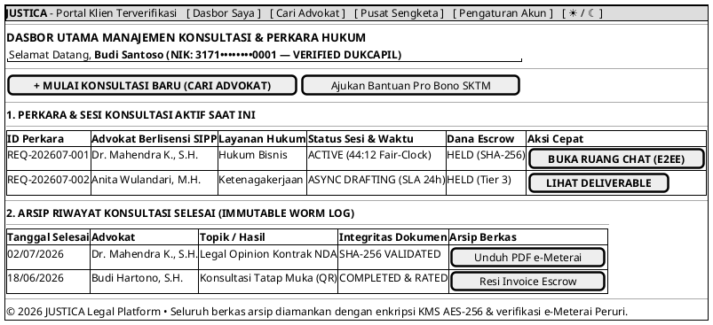

# MOCK-J-CL-02A [ORI]: Dasbor Utama Klien & Riwayat Perkara Aktif Justica

## 1. METADATA SPESIFIKASI (ENGINEERING EDITION)
| Atribut | Nilai Spesifikasi |
| :--- | :--- |
| **ID Mockup** | `MOCK-J-CL-02A` |
| **Nama Halaman** | Dasbor Manajemen Perkara & Sesi Klien (`client.justica.id/dashboard`) |
| **Aktor Target** | Klien Hukum Terverifikasi (*Verified Legal Client*) |
| **Ref. Use Case** | `J-UC03` (Akses Dasbor & Riwayat Sesi), `J-UC13` (Unduh Berkas e-Meterai) |
| **Peta Navigasi (`from` -> `to`)** | `MOCK-J-CL-01` -> `MOCK-J-CL-02A` -> `MOCK-J-CL-02` (Katalog Advokat), `MOCK-J-CL-04` (Chat Room), `MOCK-J-CL-06` (Async Room), `MOCK-J-CL-03B` (Resi Invoice), `MOCK-J-CL-09` (Pusat Sengketa), `MOCK-J-CL-10` (Pengaturan Akun) |
| **Kepatuhan Keamanan** | Client Session Isolation (RBAC), Fair-Clock State Tracking, WORM Audit Logging, Encrypted Vault Access |

---

## 2. DIAGRAM WIREFRAME LOGIS (PLANTUML SALT)

---

## 3. KAMUS DATA & ELEMEN UI (DATA FIELD DICTIONARY)
| ID Elemen | Nama Komponen UI | Tipe Data | Wajib? | Aturan Validasi Logis & Batasan Kepatuhan |
| :--- | :--- | :--- | :---: | :--- |
| `DASH-NAV-01`| `Tautan Cari Advokat` | Navigation Link | Ya | Mengalihkan klien langsung ke katalog advokat `MOCK-J-CL-02`. |
| `DASH-NAV-02`| `Pusat Sengketa`      | Navigation Link | Ya | Membuka portal pemantauan dispute & mediasi Escrow `MOCK-J-CL-09`. |
| `DASH-NAV-03`| `Pengaturan Akun`     | Navigation Link | Ya | Membuka halaman manajemen profil & privasi `MOCK-J-CL-10`. |
| `DASH-NAV-04`| `Toggle Theme Mode`   | Action Button   | Ya | Mengubah tema visual antarmuka Light/Dark Mode di local storage. |
| `DASH-BTN-01`| `Konsultasi Baru`     | Action Button   | Ya | Mengalihkan klien ke katalog advokat `MOCK-J-CL-02`. |
| `DASH-BTN-02`| `Pro Bono SKTM`       | Action Button   | Ya | Membuka modal pengajuan bantuan hukum gratis DTKS (`MOCK-J-CL-03`). |
| `DASH-TBL-01`| `Tabel Sesi Aktif`    | Data Grid       | Ya | Menampilkan seluruh sesi dengan status `ACTIVE` atau `PENDING_DELIVERABLE`. |
| `DASH-ACT-01`| `Buka Ruang Chat`     | Action Button   | Ya | Terhubung dengan sesi obrolan E2EE `MOCK-J-CL-04` menggunakan session token. |
| `DASH-ACT-02`| `Lihat Deliverable`   | Action Button   | Ya | Terhubung dengan ruang asinkron dokumen e-Meterai `MOCK-J-CL-06`. |
| `DASH-ACT-03`| `Unduh PDF e-Meterai` | Download Link   | Ya | Unduh berkas ter-stamp Peruri dengan verifikasi tanda tangan SHA-256. |
| `DASH-ACT-04`| `Resi Invoice Escrow` | Action Link     | Ya | Membuka kembali bukti transaksi resi resmi `MOCK-J-CL-03B`. |

---

## 4. MATRIKS EVENT HANDLER & TRANSISI LOGIKA
| Event Trigger | Komponen UI | Kondisi Guard (*Pre-Condition*) | Aksi Sistem (*System Response*) | Transisi Layar (*Target*) |
| :--- | :--- | :--- | :--- | :--- |
| `onClick` | Tombol `[ + MULAI KONSULTASI ]`| Akun `ACTIVE` | Memeriksa kuota & status akun, lalu mengalihkan ke katalog. | -> `MOCK-J-CL-02` (Katalog Advokat) |
| `onClick` | Tombol `[ Ajukan Pro Bono ]`   | Akun `ACTIVE` | Membuka alur pengajuan Pro Bono SKTM. | -> `MOCK-J-CL-03` (Tab 2 Pro Bono) |
| `onClick` | Tombol `[ BUKA RUANG CHAT ]`   | `session_status == ACTIVE` | Membuka koneksi WebSocket E2EE dengan kunci simetris sesi. | -> `MOCK-J-CL-04` (Chat Room E2EE) |
| `onClick` | Tombol `[ LIHAT DELIVERABLE ]` | `tier == 3` OR `async == true` | Memuat berkas PDF dan status revisi dokumen asinkron. | -> `MOCK-J-CL-06` (Async Room) |
| `onClick` | Tautan `[ Unduh PDF e-Meterai ]`| `status == VALIDATED` | Memicu unduhan binary ber-stamp Peruri resmi. | Unduhan Berkas PDF |
| `onClick` | Tautan `[ Resi Invoice Escrow ]`| `status == PAID` | Membuka arsip resi pembayaran dan SHA-256 bukti Escrow. | -> `MOCK-J-CL-03B` (Resi Invoice) |
| `onClick` | Header `[ Cari Advokat ]`      | Akun terautentikasi | Navigasi cepat ke direktori advokat. | -> `MOCK-J-CL-02` |
| `onClick` | Header `[ Pusat Sengketa ]`    | Akun terautentikasi | Navigasi ke pusat pemantauan dispute & mediasi Escrow. | -> `MOCK-J-CL-09` |
| `onClick` | Header `[ Pengaturan Akun ]`   | Akun terautentikasi | Navigasi ke pengaturan privasi & keamanan klien. | -> `MOCK-J-CL-10` |
| `onClick` | Tombol `[ ☀ / ☾ Mode ]`        | Tidak ada | Mengganti kelas CSS tema visual antarmuka. | Tetap di `MOCK-J-CL-02A` |

---

## 5. KONTRAK INTEGRASI API & DATA BINDING (*API BINDING CONTRACT*)
| Aksi UI | HTTP Method & Endpoint | Payload Request JSON | Struktur Response JSON |
| :--- | :--- | :--- | :--- |
| Muat Dasbor & Sesi | `GET /api/v2/client/dashboard-summary` | *Headers: `Authorization: Bearer <jwt>`* | `200 OK: {"active_sessions": [...], "archived_cases": [...], "kyc_status": "VERIFIED"}` |
| Unduh Dokumen Arsip | `GET /api/v2/client/archive/document/{doc_id}` | *Headers: `Authorization: Bearer <jwt>`* | `200 OK (Binary Application/PDF)` disertai Header `X-SHA256-Checksum` |

---

## 6. MATRIKS PENANGANAN ERROR & CATATAN ARSITEKTUR TEKNIS
| Kode HTTP / Error | Skenario Pemicu Kegagalan | Pesan UI ke Pengguna (*User-Facing Message*) | Mekanisme Pemulihan / Fallback |
| :--- | :--- | :--- | :--- |
| `401 Unauthorized` | JWT kedaluwarsa atau sesi berakhir | `"Sesi Anda telah habis masa berlakunya. Silakan masuk kembali."` | Pengguna otomatis dialihkan ke portal login `MOCK-J-CL-01`. |
| `403 Forbidden` | Klien mencoba mengakses perkara milik pengguna lain | `"Akses Ditolak — Perkara ini berada dalam proteksi privasi klien lain."` | Sistem mencatat upaya ke WORM Audit Trail & menolak akses. |

### Catatan Arsitektur Teknis:
1. **Fair-Clock Session Synchronizer:** Indikator waktu konsultasi (`44:12`) bersumber langsung dari NTP server resmi melalui WebSocket secara waktu nyata untuk memastikan akurasi penghitungan sesi per menit.
2. **WORM Archive Storage:** Arsip perkara yang selesai bersifat *read-only* dan tidak dapat dihapus oleh siapa pun untuk menjamin rekam jejak hukum yang tidak terbantahkan.
