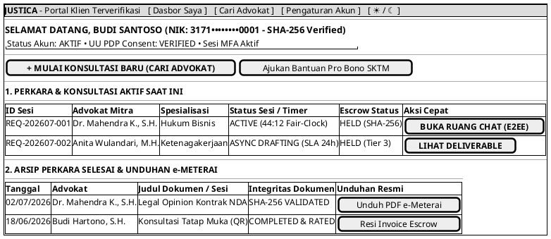

# MOCK-J-CL-02A [ORI]: Dasbor Utama Klien & Riwayat Perkara Aktif Justica

## 1. METADATA SPESIFIKASI (ENGINEERING EDITION)
| Atribut | Nilai Spesifikasi |
| :--- | :--- |
| **ID Mockup** | `MOCK-J-CL-02A` |
| **Nama Halaman** | Dasbor Utama & Pusat Manajemen Perkara Klien (`client.justica.id/dashboard`) |
| **Aktor Target** | Klien Hukum Terverifikasi (*Client*) |
| **Ref. Use Case** | `J-UC03` (Katalog), `J-UC04` (Chat), `J-UC12` (Deliverable), `J-UC15` (Pro Bono SKTM) |
| **Peta Navigasi (`from` -> `to`)** | `MOCK-J-CL-01` -> `MOCK-J-CL-02A` -> `MOCK-J-CL-02` (Cari Advokat), `MOCK-J-CL-04` (Chat Room), `MOCK-J-CL-06` (Async Room) |
| **Kepatuhan Keamanan** | JWT Bearer Session Validation, Escrow Status Real-Time Hook, PDP Consent Log Badge |

---

## 2. DIAGRAM WIREFRAME LOGIS (PLANTUML SALT)

---

## 3. CATATAN ARSITEKTUR TEKNIS
1. **Real-time Session Status:** Status sesi terhubung langsung ke WebSocket Fair-Clock Timer (`CL-04`).
2. **Integritas Arsip:** Setiap unduhan PDF divalidasi tanda tangan digital SHA-256 dan e-Meterai Peruri sebelum disajikan ke klien.
