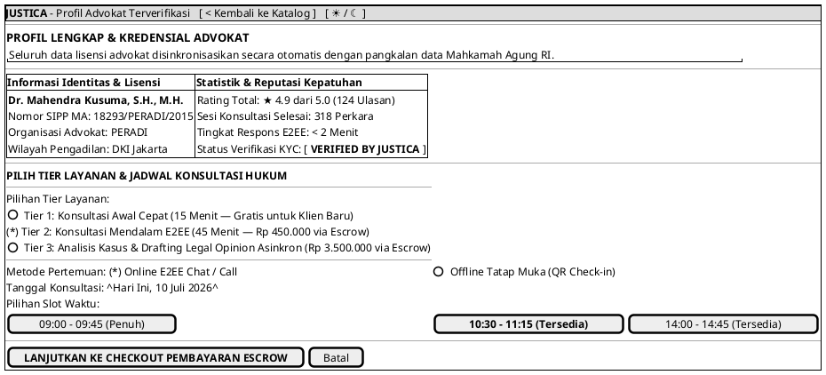

# MOCK-J-CL-02B [ORI]: Profil Lengkap Advokat & Pemilihan Jadwal Booking Justica

## 1. METADATA SPESIFIKASI (ENGINEERING EDITION)
| Atribut | Nilai Spesifikasi |
| :--- | :--- |
| **ID Mockup** | `MOCK-J-CL-02B` |
| **Nama Halaman** | Profil Lengkap, Portofolio Perkara, & Pemilihan Jadwal Booking Advokat (`client.justica.id/advocates/{id}`) |
| **Aktor Target** | Klien Hukum Terverifikasi (*Verified Legal Client*) |
| **Ref. Use Case** | `J-UC05` (Pemeriksaan Detail Profil & Lisensi), `J-UC06` (Booking Jadwal Konsultasi) |
| **Peta Navigasi (`from` -> `to`)** | `MOCK-J-CL-02` -> `MOCK-J-CL-02B` -> `MOCK-J-CL-03` (Checkout Pembayaran Escrow), `MOCK-J-CL-02` (Kembali) |
| **Kepatuhan Keamanan** | Concurrency Slot Lock (Redis Mutex TTL 15m), KYC Advokat Verified, Transparansi Biaya Mutlak |

---

## 2. DIAGRAM WIREFRAME LOGIS (PLANTUML SALT)

---

## 3. KAMUS DATA & ELEMEN UI (DATA FIELD DICTIONARY)
| ID Elemen | Nama Komponen UI | Tipe Data | Wajib? | Aturan Validasi Logis & Batasan Kepatuhan |
| :--- | :--- | :--- | :---: | :--- |
| `PROF-NAV-01`| `Kembali ke Katalog`  | Action Button | Ya | Mengarahkan kembali ke halaman katalog pencarian `MOCK-J-CL-02`. |
| `PROF-NAV-02`| `Toggle Theme Mode`   | Action Button | Ya | Mengubah tema visual antarmuka Light/Dark Mode di local storage. |
| `PROF-RAD-01`| `Pilihan Tier Layanan`| Radio Selection| Ya | Pilihan tunggal antar Tier 1 (15m), Tier 2 (45m), atau Tier 3 (Drafting + Sesi). |
| `PROF-RAD-02`| `Metode Pertemuan`    | Radio Selection| Ya | Pilihan `ONLINE_E2EE` atau `OFFLINE_QR_HANDSHAKE`. |
| `PROF-DAT-01`| `Tanggal Konsultasi`  | Date Picker | Ya | Tanggal valid (tidak boleh masa lalu `date >= today`). |
| `PROF-SLT-01`| `Pilihan Slot Waktu`  | Slot Grid | Ya | Harus memilih slot dengan status `AVAILABLE`. Slot `FULL` tidak dapat diklik. |
| `PROF-BTN-01`| `Tombol Checkout`     | Action Button | Ya | Memicu *concurrency lock* di server sebelum masuk ke halaman pembayaran. |
| `PROF-BTN-02`| `Tombol Batal`        | Action Button | Ya | Membatalkan pilihan slot aktif dan kembali ke katalog advokat `MOCK-J-CL-02`. |

---

## 4. MATRIKS EVENT HANDLER & TRANSISI LOGIKA
| Event Trigger | Komponen UI | Kondisi Guard (*Pre-Condition*) | Aksi Sistem (*System Response*) | Transisi Layar (*Target*) |
| :--- | :--- | :--- | :--- | :--- |
| `onClick` | Tombol `[ 10:30 - 11:15 ]` | `slot.status == AVAILABLE` | Kunci sementara slot di Redis (Mutex TTL 15 menit), ubah status tombol menjadi *Selected*. | Tetap di `MOCK-J-CL-02B` |
| `onClick` | Tombol `[ LANJUT CHECKOUT ]`| `slot == SELECTED` & `tier != NULL` | Buat draf transaksi Escrow (`booking_id`), alihkan ke halaman checkout. | -> `MOCK-J-CL-03` (Checkout Escrow) |
| `onClick` | Tombol `[ Batal ]`         | Tidak ada | Lepaskan kunci slot di Redis (jika ada), alihkan kembali ke katalog. | -> `MOCK-J-CL-02` |
| `onClick` | Tombol `[ < Kembali ]`     | Tidak ada | Navigasi kembali ke direktori pencarian advokat. | -> `MOCK-J-CL-02` |
| `onClick` | Tombol `[ ☀ / ☾ Mode ]`    | Tidak ada | Mengganti tema visual antarmuka Light/Dark Mode. | Tetap di `MOCK-J-CL-02B` |

---

## 5. KONTRAK INTEGRASI API & DATA BINDING (*API BINDING CONTRACT*)
| Aksi UI | HTTP Method & Endpoint | Payload Request JSON | Struktur Response JSON |
| :--- | :--- | :--- | :--- |
| Kunci Slot Waktu | `POST /api/v2/client/booking/lock-slot` | `{"advocate_id": "AD-101", "slot_time": "2026-07-10T10:30:00Z", "tier": "TIER_2"}` | `200 OK: {"booking_id": "BKG-881", "lock_expires_in": 900}` |

---

## 6. MATRIKS PENANGANAN ERROR & CATATAN ARSITEKTUR TEKNIS
| Kode HTTP / Error | Skenario Pemicu Kegagalan | Pesan UI ke Pengguna (*User-Facing Message*) | Mekanisme Pemulihan / Fallback |
| :--- | :--- | :--- | :--- |
| `409 Conflict` | Slot waktu baru saja diambil oleh klien lain | `"Mohon maaf, slot waktu ini baru saja dipesan oleh pengguna lain."` | Sistem memperbarui grid slot secara otomatis dan meminta klien memilih slot lain. |
| `400 Bad Request`| Pemesanan slot melebihi batas jam kerja | `"Pemilihan jadwal berada di luar jam operasional advokat."` | Kalender dibatasi hanya pada slot valid `AVAILABLE`. |

### Catatan Arsitektur Teknis:
1. **Distributed Concurrency Lock:** Sistem menggunakan *Redis Mutex Lock* dengan TTL 15 menit agar dua klien tidak bisa memesan slot waktu advokat yang sama pada hitungan detik yang sama (*race condition preventer*).
2. **Transparent Escrow Pricing:** Tidak ada biaya tambahan tersembunyi (*no hidden fees*); seluruh tagihan yang ditampilkan sudah mencakup pajak dan biaya administrasi escrow.
