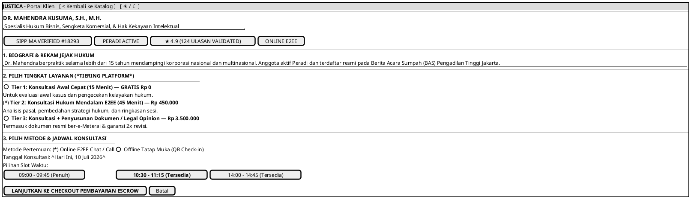

# MOCK-J-CL-02B [ORI]: Profil Detail Advokat & Pemilihan Jadwal Booking Justica

## 1. METADATA SPESIFIKASI (ENGINEERING EDITION)
| Atribut | Nilai Spesifikasi |
| :--- | :--- |
| **ID Mockup** | `MOCK-J-CL-02B` |
| **Nama Halaman** | Profil Lengkap Advokat & Booking Slot (`client.justica.id/advocates/mahendra-kusuma`) |
| **Aktor Target** | Klien Hukum Terverifikasi (*Client*) |
| **Ref. Use Case** | `J-UC03` (Cari & Lihat Detail Advokat), `J-UC05` (Pilih Jadwal & Lanjut ke Checkout) |
| **Peta Navigasi (`from` -> `to`)** | `MOCK-J-CL-02` -> `MOCK-J-CL-02B` -> `MOCK-J-CL-03` (Checkout Pembayaran Escrow) |
| **Kepatuhan Keamanan** | SIPP MA Credential Verification SHA-256, Slot Concurrency Locking (Mutex Redis TTL 15m) |

---

## 2. DIAGRAM WIREFRAME LOGIS (PLANTUML SALT)

---

## 3. CATATAN ARSITEKTUR TEKNIS
1. **Mutex Concurrency Locking:** Saat slot `10:30` dipilih, sistem mengunci slot di Redis selama 15 menit agar tidak terjadi pesanan ganda (*double booking*) saat checkout di `CL-03`.
