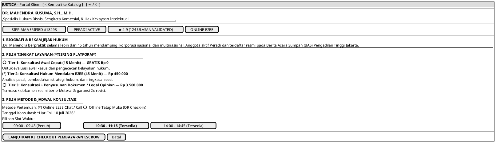

# MOCK-J-CL-02B [ORI]: Profil Detail Advokat & Pemilihan Jadwal Booking Justica

## 1. METADATA SPESIFIKASI (ENGINEERING EDITION)
| Atribut | Nilai Spesifikasi |
| :--- | :--- |
| **ID Mockup** | `MOCK-J-CL-02B` |
| **Nama Halaman** | Profil Lengkap Advokat & Booking Slot (`client.justica.id/advocates/mahendra-kusuma`) |
| **Aktor Target** | Klien Hukum Terverifikasi (*Client*) |
| **Ref. Use Case** | `J-UC03` (Cari & Lihat Detail Advokat), `J-UC05` (Pilih Jadwal & Lanjut ke Checkout) |
| **Peta Navigasi (`from` -> `to`)** | `MOCK-J-CL-02` -> `MOCK-J-CL-02B` -> `MOCK-J-CL-03` (Checkout Pembayaran Escrow) |
| **Kepatuhan Keamanan** | SIPP MA Credential Verification SHA-256, Slot Concurrency Locking (Mutex Redis TTL 15m) |

---

## 2. DIAGRAM WIREFRAME LOGIS (PLANTUML SALT)

---

## 3. KAMUS DATA & ELEMEN UI (DATA FIELD DICTIONARY)
| ID Elemen | Nama Komponen UI | Tipe Data | Wajib? | Aturan Validasi Logis & Batasan Kepatuhan |
| :--- | :--- | :--- | :---: | :--- |
| `PROF-RAD-01`| `Pilihan Tier Layanan`| Radio Selection| Ya | Pilihan tunggal antar Tier 1 (15m), Tier 2 (45m), atau Tier 3 (Drafting + Sesi). |
| `PROF-RAD-02`| `Metode Pertemuan`    | Radio Selection| Ya | Pilihan `ONLINE_E2EE` atau `OFFLINE_QR_HANDSHAKE`. |
| `PROF-DAT-01`| `Tanggal Konsultasi`  | Date Picker | Ya | Tanggal valid (tidak boleh masa lalu `date >= today`). |
| `PROF-SLT-01`| `Pilihan Slot Waktu`  | Slot Grid | Ya | Harus memilih slot dengan status `AVAILABLE`. Slot `FULL` tidak dapat diklik. |
| `PROF-BTN-01`| `Tombol Checkout`     | Action Button | Ya | Memicu *concurrency lock* di server sebelum masuk ke halaman pembayaran. |

---

## 4. MATRIKS EVENT HANDLER & TRANSISI LOGIKA
| Event Trigger | Komponen UI | Kondisi Guard (*Pre-Condition*) | Aksi Sistem (*System Response*) | Transisi Layar (*Target*) |
| :--- | :--- | :--- | :--- | :--- |
| `onClick` | Tombol `[ 10:30 - 11:15 ]` | `slot.status == AVAILABLE` | Kunci sementara slot di Redis (Mutex TTL 15 menit), ubah status tombol menjadi *Selected*. | Tetap di `MOCK-J-CL-02B` |
| `onClick` | Tombol `[ LANJUT CHECKOUT ]`| `slot == SELECTED` & `tier != NULL` | Buat draf transaksi Escrow (`booking_id`), alihkan ke halaman checkout. | -> `MOCK-J-CL-03` (Checkout Escrow) |

---

## 5. KONTRAK INTEGRASI API & DATA BINDING (*API BINDING CONTRACT*)
| Aksi UI | HTTP Method & Endpoint | Payload Request JSON | Struktur Response JSON |
| :--- | :--- | :--- | :--- |
| Kunci Slot Jadwal | `POST /api/v2/client/booking/lock-slot` | `{"advocate_id": "AD-101", "slot_id": "SLOT-1030", "tier": 2, "meeting_type": "ONLINE_E2EE"}` | `200 OK: {"booking_id": "REQ-202607-003", "lock_expires_in_seconds": 900}` |

---

## 6. MATRIKS PENANGANAN ERROR & CATATAN ARSITEKTUR TEKNIS
| Kode HTTP / Error | Skenario Pemicu Kegagalan | Pesan UI ke Pengguna (*User-Facing Message*) | Mekanisme Pemulihan / Fallback |
| :--- | :--- | :--- | :--- |
| `409 Conflict`  | Slot waktu direbut pengguna lain dalam detik yang sama | `"Maaf, slot waktu ini baru saja dipesan klien lain. Silakan pilih jam lain yang tersedia."` | Slot grid diperbarui secara *real-time* dan slot yang terisi berubah menjadi merah (`FULL`). |
| `400 Bad Request`| Pilihan tier atau metode belum lengkap | `"Mohon pilih tingkat layanan (Tier) dan metode konsultasi terlebih dahulu."` | Bagian yang belum dipilih ditandai dengan *border outline warning*. |

### Catatan Arsitektur Teknis:
1. **Mutex Concurrency Locking:** Saat slot `10:30` dipilih, sistem mengunci slot di Redis selama 15 menit agar tidak terjadi pesanan ganda (*double booking*) saat checkout di `CL-03`.
