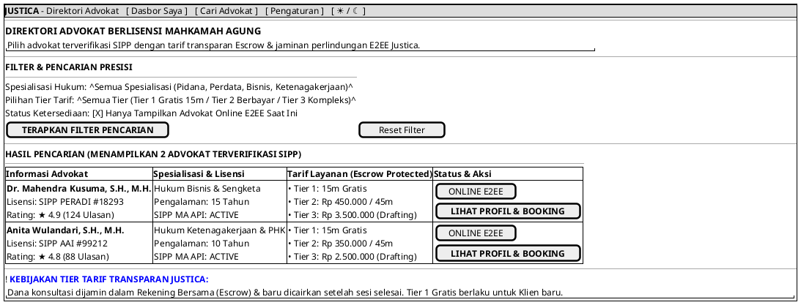

# MOCK-J-CL-02 [ORI]: Katalog Advokat & Direktori Layanan Justica

## 1. METADATA SPESIFIKASI (ENGINEERING EDITION)
| Atribut | Nilai Spesifikasi |
| :--- | :--- |
| **ID Mockup** | `MOCK-J-CL-02` |
| **Nama Halaman** | Direktori & Katalog Pencarian Advokat Terverifikasi SIPP (`client.justica.id/advocates`) |
| **Aktor Target** | Klien Hukum Terverifikasi (*Verified Legal Client*) |
| **Ref. Use Case** | `J-UC04` (Pencarian & Filter Advokat), `J-UC05` (Pemilihan Tier Layanan & Booking) |
| **Peta Navigasi (`from` -> `to`)** | `MOCK-J-CL-02A` -> `MOCK-J-CL-02` -> `MOCK-J-CL-02B` (Profil & Booking Advokat), `MOCK-J-CL-10` (Pengaturan) |
| **Kepatuhan Keamanan** | Anti-Scraping Rate Limit (60 queries/min), Dynamic Token Search Guard, Real-time SIPP MA Status Verify |

---

## 2. DIAGRAM WIREFRAME LOGIS (PLANTUML SALT)

---

## 3. KAMUS DATA & ELEMEN UI (DATA FIELD DICTIONARY)
| ID Elemen | Nama Komponen UI | Tipe Data | Wajib? | Aturan Validasi Logis & Batasan Kepatuhan |
| :--- | :--- | :--- | :---: | :--- |
| `CAT-NAV-01` | `Tautan Dasbor Saya`  | Navigation Link | Ya | Kembali ke dasbor utama klien `MOCK-J-CL-02A`. |
| `CAT-NAV-02` | `Tautan Pengaturan`   | Navigation Link | Ya | Navigasi ke manajemen pengaturan profil `MOCK-J-CL-10`. |
| `CAT-NAV-03` | `Toggle Theme Mode`   | Action Button   | Ya | Mengubah tema visual antarmuka Light/Dark Mode di local storage. |
| `CAT-SEL-01` | `Filter Spesialisasi` | Dropdown | Tidak | Pilihan bidang hukum (Pidana, Perdata, Bisnis, Ketenagakerjaan, dll). |
| `CAT-SEL-02` | `Filter Tier Tarif`   | Dropdown | Tidak | Pilihan rentang Tier 1 (Gratis), Tier 2 (Konsultasi), dan Tier 3 (Drafting). |
| `CAT-CHK-01` | `Filter Online Only`  | Boolean  | Tidak | Jika `true`, hanya menampilkan advokat dengan sinyal *heartbeat* WebSocket aktif (<30s). |
| `CAT-BTN-01` | `Terapkan Filter`     | Action   | Ya    | Menjalankan kueri terindeks ElasticSearch dengan proteksi anti-scraping. |
| `CAT-BTN-02` | `Reset Filter`        | Action   | Ya    | Mengembalikan seluruh parameter dropdown dan checkbox ke kondisi *default*. |
| `CAT-CARD-01`| `Kartu Advokat`       | Component| N/A   | Menampilkan lencana sinkronisasi SIPP MA aktif dan tarif transparan escrow. |

---

## 4. MATRIKS EVENT HANDLER & TRANSISI LOGIKA
| Event Trigger | Komponen UI | Kondisi Guard (*Pre-Condition*) | Aksi Sistem (*System Response*) | Transisi Layar (*Target*) |
| :--- | :--- | :--- | :--- | :--- |
| `onClick` | Tombol `[ TERAPKAN FILTER ]` | `RateLimit <= 60/min` | Memuat ulang daftar kartu advokat sesuai parameter filter ter-sanitasi. | Tetap di `MOCK-J-CL-02` |
| `onClick` | Tombol `[ Reset Filter ]`    | Tidak ada | Kosongkan seluruh filter ke setelan awal dan jalankan pencarian ulang. | Tetap di `MOCK-J-CL-02` |
| `onClick` | Tombol `[ LIHAT PROFIL ]`    | `advocate.status == VERIFIED` | Mengirimkan ID advokat dan memuat halaman profil lengkap. | -> `MOCK-J-CL-02B` (Profil Advokat) |
| `onClick` | Header `[ Dasbor Saya ]`     | Sesi Klien Aktif | Kembali ke halaman dasbor utama klien. | -> `MOCK-J-CL-02A` |
| `onClick` | Header `[ Pengaturan ]`      | Sesi Klien Aktif | Masuk ke halaman konfigurasi privasi klien. | -> `MOCK-J-CL-10` |
| `onClick` | Tombol `[ ☀ / ☾ Mode ]`      | Tidak ada | Mengganti tema visual antarmuka Light/Dark Mode. | Tetap di `MOCK-J-CL-02` |

---

## 5. KONTRAK INTEGRASI API & DATA BINDING (*API BINDING CONTRACT*)
| Aksi UI | HTTP Method & Endpoint | Payload Request JSON | Struktur Response JSON |
| :--- | :--- | :--- | :--- |
| Filter & Cari Advokat | `GET /api/v2/client/advocates?spec={spec}&tier={tier}&online={bool}` | *Query Params Encoded* | `200 OK: {"advocates": [{"id": "AD-101", "name": "Dr. Mahendra", "sipp_status": "ACTIVE", ...}]}` |

---

## 6. MATRIKS PENANGANAN ERROR & CATATAN ARSITEKTUR TEKNIS
| Kode HTTP / Error | Skenario Pemicu Kegagalan | Pesan UI ke Pengguna (*User-Facing Message*) | Mekanisme Pemulihan / Fallback |
| :--- | :--- | :--- | :--- |
| `404 Not Found` | Filter tidak menghasilkan advokat | `"Tidak ditemukan advokat yang sesuai kriteria pencarian Anda."` | Tombol `[ Reset Filter ]` disorot untuk mengembalikan daftar lengkap. |
| `429 Too Many Req`| Scraping detection (>60 req/min) | `"Batas permintaan pencarian tercapai demi keamanan direktori."` | Tanda jeda sementara 60 detik sebelum pencarian berikutnya diizinkan. |

### Catatan Arsitektur Teknis:
1. **SIPP API Integration:** Badge `SIPP MA API: ACTIVE` memverifikasi secara langsung status nomor induk advokat di database Mahkamah Agung.
2. **Anti-Scraping Protection:** Pencarian katalog dibatasi maksimal 60 kueri per menit per sesi untuk mencegah pencurian data direktori advokat.
