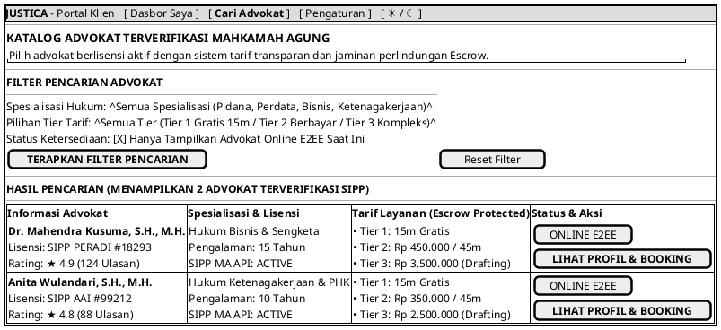

# MOCK-J-CL-02 [ORI]: Katalog Advokat & Direktori Layanan Hukum Justica

## 1. METADATA SPESIFIKASI (ENGINEERING EDITION)
| Atribut | Nilai Spesifikasi |
| :--- | :--- |
| **ID Mockup** | `MOCK-J-CL-02` |
| **Nama Halaman** | Direktori Advokat & Pencarian Layanan (`client.justica.id/advocates`) |
| **Aktor Target** | Klien Hukum Terverifikasi (*Client*) |
| **Ref. Use Case** | `J-UC03` (Pencarian & Filter Advokat Terverifikasi SIPP MA) |
| **Peta Navigasi (`from` -> `to`)** | `MOCK-J-CL-02A` -> `MOCK-J-CL-02` -> `MOCK-J-CL-02B` (Profil Detail Advokat) |
| **Kepatuhan Keamanan** | SIPP MA API Sync Badge, ElasticSearch Query Sanitization, Anti-Scraping Rate Limit |

---

## 2. DIAGRAM WIREFRAME LOGIS (PLANTUML SALT)

---

## 3. KAMUS DATA & ELEMEN UI (DATA FIELD DICTIONARY)
| ID Elemen | Nama Komponen UI | Tipe Data | Wajib? | Aturan Validasi Logis & Batasan Kepatuhan |
| :--- | :--- | :--- | :---: | :--- |
| `CAT-SEL-01` | `Filter Spesialisasi` | Dropdown | Tidak | Pilihan bidang hukum resmi (Pidana, Perdata, Bisnis, Ketenagakerjaan, Tata Usaha Negara). |
| `CAT-SEL-02` | `Filter Tier Tarif`   | Dropdown | Tidak | Pilihan rentang Tier 1 (Gratis), Tier 2 (Konsultasi), dan Tier 3 (Drafting). |
| `CAT-CHK-01` | `Filter Online Only`  | Boolean  | Tidak | Jika `true`, hanya menampilkan advokat dengan sinyal *heartbeat* WebSocket aktif (<30s). |
| `CAT-BTN-01` | `Terapkan Filter`     | Action   | Ya    | Menjalankan kueri terindeks ElasticSearch dengan proteksi anti-scraping. |
| `CAT-CARD-01`| `Kartu Advokat`       | Component| N/A   | Menampilkan lencana sinkronisasi SIPP MA aktif dan tarif transparan escrow. |

---

## 4. MATRIKS EVENT HANDLER & TRANSISI LOGIKA
| Event Trigger | Komponen UI | Kondisi Guard (*Pre-Condition*) | Aksi Sistem (*System Response*) | Transisi Layar (*Target*) |
| :--- | :--- | :--- | :--- | :--- |
| `onClick` | Tombol `[ TERAPKAN FILTER ]` | `RateLimit <= 60/min` | Memuat ulang daftar kartu advokat sesuai parameter filter ter-sanitasi. | Tetap di `MOCK-J-CL-02` |
| `onClick` | Tombol `[ LIHAT PROFIL ]`    | `advocate.status == VERIFIED` | Mengirimkan ID advokat dan memuat halaman profil lengkap. | -> `MOCK-J-CL-02B` (Profil Advokat) |

---

## 5. CATATAN ARSITEKTUR TEKNIS & COMPLIANCE HOOKS
1. **SIPP API Integration:** Badge `SIPP MA API: ACTIVE` memverifikasi secara langsung status nomor induk advokat di database Mahkamah Agung.
2. **Anti-Scraping Protection:** Pencarian katalog dibatasi maksimal 60 kueri per menit per sesi untuk mencegah pencurian data direktori advokat.
