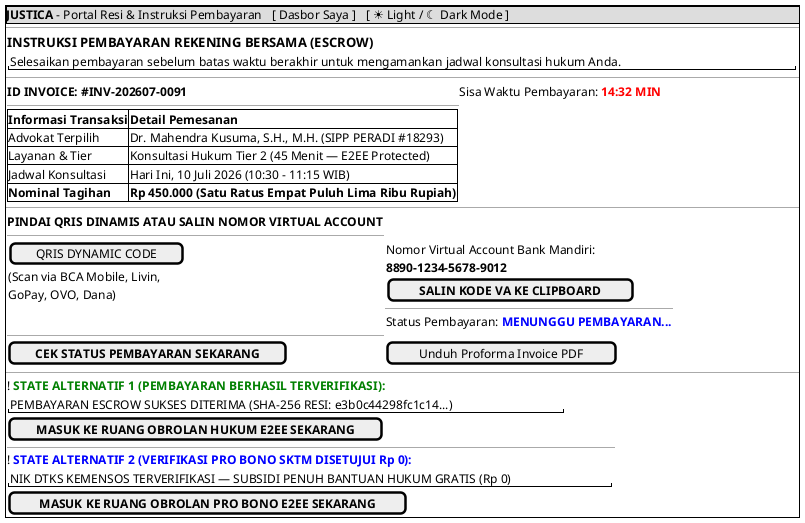

# MOCK-J-CL-03B [ORI]: Instruksi Pembayaran VA/QRIS & Resi e-Invoice Escrow Justica

## 1. METADATA SPESIFIKASI (ENGINEERING EDITION)
| Atribut | Nilai Spesifikasi |
| :--- | :--- |
| **ID Mockup** | `MOCK-J-CL-03B` |
| **Nama Halaman** | Portal Instruksi Pembayaran & Resi Kriptografi Escrow (`client.justica.id/invoice/{id}`) |
| **Aktor Target** | Klien Hukum Terverifikasi (*Verified Legal Client*) |
| **Ref. Use Case** | `J-UC05` (`ST-J-07`: Membayar Biaya Konsultasi Escrow & Webhook Verifikasi Signature SHA-256) |
| **Peta Navigasi (`from` -> `to`)** | `MOCK-J-CL-03` -> `MOCK-J-CL-03B` -> `MOCK-J-CL-04` (Ruang Obrolan Hukum E2EE), `MOCK-J-CL-02A` (Dasbor Saya) |
| **Kepatuhan Keamanan** | SHA-256 Digital Receipt Hash, Midtrans/Xendit Webhook Sign-Verify, Realtime WebSocket Payment Polling |

---

## 2. DIAGRAM WIREFRAME LOGIS (PLANTUML SALT)

---

## 3. KAMUS DATA & ELEMEN UI (DATA FIELD DICTIONARY)
| ID Elemen | Nama Komponen UI | Tipe Data | Wajib? | Aturan Validasi Logis & Batasan Kepatuhan |
| :--- | :--- | :--- | :---: | :--- |
| `INV-NAV-01` | `Tautan Dasbor Saya`| Navigation Link | Ya | Kembali ke dasbor utama klien `MOCK-J-CL-02A`. |
| `INV-NAV-02` | `Toggle Theme Mode` | Action Button   | Ya | Mengubah tema visual antarmuka Light/Dark Mode di local storage. |
| `INV-OUT-01` | `Nomor Invoice`     | String | Ya | Format unik `INV-YYYYMM-XXXX`. |
| `INV-TMR-01` | `Timer Batas Bayar` | Timer Countdown| Ya | Hitung mundur 15 menit dari inisiasi transaksi. |
| `INV-QR-01`  | `Dynamic QRIS`      | Image Base64 | Ya | QR Code EMVCo standar bersertifikasi Bank Indonesia. |
| `INV-BTN-01` | `Salin VA Code`     | Action Button | Ya | Menyalin string nomor Virtual Account ke *clipboard* sistem. |
| `INV-BTN-02` | `Cek Status Bayar`  | Action Button | Ya | Meminta *polling manual sync* ke payment gateway API. |
| `INV-BTN-03` | `Masuk Ruang Chat`  | Action Button | Ya | Aktif (*enabled*) HANYA JIKA status transaksi `PAID_ESCROW_HELD`. |
| `INV-BTN-04` | `Unduh Proforma PDF`| Action Button | Ya | Mengunduh rincian proforma invoice dalam format PDF. |

---

## 4. MATRIKS EVENT HANDLER & TRANSISI LOGIKA
| Event Trigger | Komponen UI | Kondisi Guard (*Pre-Condition*) | Aksi Sistem (*System Response*) | Transisi Layar (*Target*) |
| :--- | :--- | :--- | :--- | :--- |
| `onClick` | Tombol `[ SALIN KODE VA ]` | Tidak ada | Salin nomor rekening VA ke clipboard dan tampilkan toast `"Disalin!"`. | Tetap di `MOCK-J-CL-03B` |
| `onClick` | Tombol `[ CEK STATUS BAYAR ]`| `Timer > 0` | Panggil API gateway untuk memverifikasi status pembayaran terkini. | Tetap (Update status dinamis) |
| `onClick` | Tombol `[ MASUK RUANG CHAT ]`| `Status == PAID_ESCROW_HELD`| Buka sesi koneksi E2EE dengan parameter token ruangan obrolan. | -> `MOCK-J-CL-04` (Chat Room E2EE) |
| `onClick` | Tombol `[ Unduh Proforma PDF ]`| Tidak ada | Mengirimkan berkas binary proforma invoice PDF ber-hash SHA-256. | Unduhan Berkas PDF |
| `onClick` | Header `[ Dasbor Saya ]`   | Sesi Klien Aktif | Kembali ke halaman dasbor utama klien. | -> `MOCK-J-CL-02A` |
| `onClick` | Tombol `[ ☀ / ☾ Mode ]`    | Tidak ada | Mengganti tema visual antarmuka Light/Dark Mode. | Tetap di `MOCK-J-CL-03B` |

---

## 5. KONTRAK INTEGRASI API & DATA BINDING (*API BINDING CONTRACT*)
| Aksi UI | HTTP Method & Endpoint | Payload Request JSON | Struktur Response JSON |
| :--- | :--- | :--- | :--- |
| Cek Status Pembayaran | `GET /api/v2/checkout/status/{invoice_id}` | *Headers: `Authorization: Bearer <jwt>`* | `200 OK: {"status": "PAID_ESCROW_HELD", "receipt_sha256": "e3b0c4...", "chat_room_ready": true}` |

---

## 6. MATRIKS PENANGANAN ERROR & CATATAN ARSITEKTUR TEKNIS
| Kode HTTP / Error | Skenario Pemicu Kegagalan | Pesan UI ke Pengguna (*User-Facing Message*) | Mekanisme Pemulihan / Fallback |
| :--- | :--- | :--- | :--- |
| `408 Request Timeout`| Waktu 15 menit berakhir (`Timer == 00:00`) | `"Waktu pembayaran habis. Jadwal konsultasi Anda telah dilepaskan."` | Tombol `[ MASUK CHAT ]` dinonaktifkan, klien diarahkan untuk memesan ulang. |
| `400 Signature Error`| Webhook tanda tangan tidak cocok | `"Peringatan: Verifikasi kriptografi pembayaran gagal."` | Transaksi ditahan untuk investigasi manual tim kepatuhan Justica. |

### Catatan Arsitektur Teknis:
1. **Webhook HMAC-SHA256 Verification:** Setiap notifikasi pembayaran masuk diverifikasi menggunakan *HMAC signature validation* dari penyedia gateway sebelum mengubah status rekening Escrow menjadi `PAID_ESCROW_HELD`.
2. **Instant Room Unlock:** Segera setelah pembayaran diverifikasi, tombol masuk ke ruang obrolan E2EE langsung menyala tanpa perlu me-refresh halaman browser.
