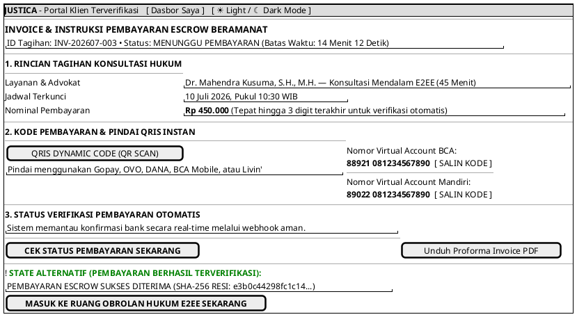

# MOCK-J-CL-03B [ORI]: Instruksi Pembayaran VA/QRIS & Resi e-Invoice Escrow Justica

## 1. METADATA SPESIFIKASI (ENGINEERING EDITION)
| Atribut | Nilai Spesifikasi |
| :--- | :--- |
| **ID Mockup** | `MOCK-J-CL-03B` |
| **Nama Halaman** | Instruksi Pembayaran Escrow & Resi Digital (`client.justica.id/invoice/INV-202607-003`) |
| **Aktor Target** | Klien Hukum Terverifikasi (*Client*) |
| **Ref. Use Case** | `J-UC05` (Pembayaran Rekening Bersama Escrow 75/25), `J-UC14` (Integritas Resi SHA-256) |
| **Peta Navigasi (`from` -> `to`)** | `MOCK-J-CL-03` -> `MOCK-J-CL-03B` -> `MOCK-J-CL-04` (Chat Room E2EE), `MOCK-J-CL-05` (Offline QR) |
| **Kepatuhan Keamanan** | SHA-256 Invoice Signature, MIDTRANS/BI-FAST Webhook Idempotency, TLS 1.3 Mandatory |

---

## 2. DIAGRAM WIREFRAME LOGIS (PLANTUML SALT)

---

## 3. KAMUS DATA & ELEMEN UI (DATA FIELD DICTIONARY)
| ID Elemen | Nama Komponen UI | Tipe Data | Wajib? | Aturan Validasi Logis & Batasan Kepatuhan |
| :--- | :--- | :--- | :---: | :--- |
| `INV-OUT-01` | `Nomor Invoice` | String | Ya | Format unik `INV-YYYYMM-XXXX`. |
| `INV-TMR-01` | `Timer Batas Bayar`| Timer Countdown| Ya | Hitung mundur 15 menit dari inisiasi transaksi. |
| `INV-QR-01`  | `Dynamic QRIS`  | Image Base64 | Ya | QR Code EMVCo standar bersertifikasi Bank Indonesia. |
| `INV-BTN-01` | `Salin VA Code` | Action Button | Ya | Menyalin string nomor Virtual Account ke *clipboard* sistem. |
| `INV-BTN-02` | `Cek Status Bayar`| Action Button | Ya | Meminta *polling manual sync* ke payment gateway API. |
| `INV-BTN-03` | `Masuk Ruang Chat`| Action Button | Ya | Aktif (*enabled*) HANYA JIKA status transaksi `PAID_ESCROW_HELD`. |

---

## 4. MATRIKS EVENT HANDLER & TRANSISI LOGIKA
| Event Trigger | Komponen UI | Kondisi Guard (*Pre-Condition*) | Aksi Sistem (*System Response*) | Transisi Layar (*Target*) |
| :--- | :--- | :--- | :--- | :--- |
| `onClick` | Tombol `[ SALIN KODE ]` | VA String tersedia | Menyalin nomor ke clipboard, menampilkan *toast* `"Disalin"`. | Tetap di `MOCK-J-CL-03B` |
| `onClick` | Tombol `[ CEK STATUS ]` | `Timer > 0` | Mengirim request `GET status` ke Payment Gateway Midtrans/BI-FAST. | Tetap (Update badge status) |
| `onWebhook`| Payment Gateway Webhook | Signature SHA-512 Valid | Mengubah status transaksi menjadi `PAID_ESCROW_HELD`, mengaktifkan tombol masuk ruang obrolan. | State Alternatif (Hijau) |
| `onClick` | Tombol `[ MASUK RUANG CHAT ]`| `status == PAID_ESCROW_HELD` | Membuka koneksi sesi konsultasi online `MOCK-J-CL-04`. | -> `MOCK-J-CL-04` (Chat Room) |

---

## 5. KONTRAK INTEGRASI API & DATA BINDING (*API BINDING CONTRACT*)
| Aksi UI | HTTP Method & Endpoint | Payload Request JSON | Struktur Response JSON |
| :--- | :--- | :--- | :--- |
| Cek Status Tagihan | `GET /api/v2/client/invoices/INV-202607-003/status` | *Headers: `Authorization: Bearer <jwt>`* | `200 OK: {"invoice_id": "INV-202607-003", "status": "PAID_ESCROW_HELD", "receipt_sha256": "e3b0c4..."}` |
| Payment Gateway Webhook| `POST /api/v2/webhooks/payment/callback` | `{"order_id": "INV-202607-003", "transaction_status": "settlement", "signature_key": "sha512..."}` | `200 OK: {"status": "SUCCESS_RECORDED"}` |

---

## 6. MATRIKS PENANGANAN ERROR & CATATAN ARSITEKTUR TEKNIS
| Kode HTTP / Error | Skenario Pemicu Kegagalan | Pesan UI ke Pengguna (*User-Facing Message*) | Mekanisme Pemulihan / Fallback |
| :--- | :--- | :--- | :--- |
| `408 Request Timeout`| Batas waktu 15 menit habis sebelum pembayaran masuk | `"Batas waktu pembayaran telah kedaluwarsa. Tagihan dibatalkan secara otomatis."` | Tombol `CEK STATUS` dinonaktifkan; pengguna dialihkan ke Dasbor (`CL-02A`). |
| `502 Bad Gateway`| Payment Gateway API sedang pemeliharaan | `"Verifikasi status otomatis tertunda dari bank. Sistem akan memeriksa ulang setiap 30 detik."` | Aktifkan *background polling fallback* setiap 30 detik. |

### Catatan Arsitektur Teknis:
1. **Escrow Holding Protocol:** Dana yang dibayarkan dikunci di Rekening Bersama (75% advokat, 25% platform) dan tidak dicairkan sebelum use case `J-UC12` selesai.
2. **SHA-256 Receipt Validation:** Resi digital yang dihasilkan dibubuhi *hash digest SHA-256* untuk verifikasi keaslian.
