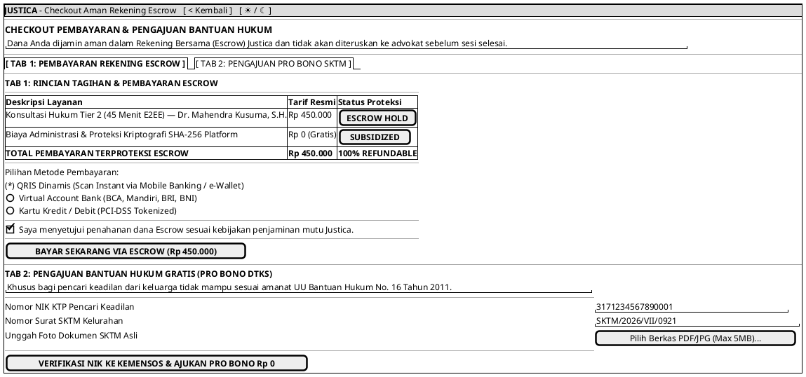

# MOCK-J-CL-03 [ORI]: Checkout Pembayaran Escrow & Pengajuan Pro Bono SKTM Justica

## 1. METADATA SPESIFIKASI (ENGINEERING EDITION)
| Atribut | Nilai Spesifikasi |
| :--- | :--- |
| **ID Mockup** | `MOCK-J-CL-03` |
| **Nama Halaman** | Checkout Pembayaran Rekening Bersama (Escrow) & Pro Bono DTKS (`client.justica.id/checkout`) |
| **Aktor Target** | Klien Hukum Terverifikasi (*Verified Legal Client*) |
| **Ref. Use Case** | `J-UC06` (Checkout Pembayaran Escrow), `J-UC07` (Pengajuan Bantuan Pro Bono SKTM) |
| **Peta Navigasi (`from` -> `to`)** | `MOCK-J-CL-02B` -> `MOCK-J-CL-03` -> `MOCK-J-CL-03B` (Instruksi Pembayaran & Resi), `MOCK-J-CL-02B` (Kembali) |
| **Kepatuhan Keamanan** | Idempotency Key SHA-256, Zero-Storage PCI-DSS Tokenization, DTKS Kemensos API Verification |

---

## 2. DIAGRAM WIREFRAME LOGIS (PLANTUML SALT)

---

## 3. KAMUS DATA & ELEMEN UI (DATA FIELD DICTIONARY)
| ID Elemen | Nama Komponen UI | Tipe Data | Wajib? | Aturan Validasi Logis & Batasan Kepatuhan |
| :--- | :--- | :--- | :---: | :--- |
| `CHK-NAV-01` | `Tombol Kembali`    | Action Button| Ya | Mengarahkan kembali ke profil advokat `MOCK-J-CL-02B`. |
| `CHK-NAV-02` | `Toggle Theme Mode` | Action Button| Ya | Mengubah tema visual antarmuka Light/Dark Mode di local storage. |
| `CHK-TAB-01` | `Selector Tab Mode` | Tab Control  | Ya | Peralihan antara `TAB_ESCROW` dan `TAB_PROBONO`. |
| `CHK-RAD-01` | `Metode Pembayaran` | Radio Selection| Ya* | Pilihan QRIS, VA, atau Kartu Kredit. *Wajib jika berada di Tab 1 (Escrow). |
| `CHK-CHK-01` | `Consent Escrow`    | Boolean | Ya | Wajib `true` untuk memproses pembayaran Escrow. |
| `CHK-BTN-01` | `Bayar Sekarang`    | Action Button| Ya* | Menerbitkan transaksi pembayaran Escrow idempoten. *Wajib untuk Tab 1. |
| `CHK-IN-01`  | `NIK Pemohon SKTM`  | Numeric | Ya* | 16 Digit numerik (`^[0-9]{16}$`). *Wajib jika mengajukan di Tab 2 (Pro Bono). |
| `CHK-IN-02`  | `Nomor SKTM`        | String  | Ya* | Nomor resmi surat keterangan tidak mampu kelurahan. |
| `CHK-UP-01`  | `Unggah Berkas SKTM`| File Binary | Ya* | Format `.pdf`/`.jpg` maksimal 5MB. |
| `CHK-BTN-02` | `Ajukan Pro Bono`   | Action Button| Ya* | Mengirim permohonan verifikasi DTKS Kemensos. *Wajib untuk Tab 2. |

---

## 4. MATRIKS EVENT HANDLER & TRANSISI LOGIKA
| Event Trigger | Komponen UI | Kondisi Guard (*Pre-Condition*) | Aksi Sistem (*System Response*) | Transisi Layar (*Target*) |
| :--- | :--- | :--- | :--- | :--- |
| `onClick` | Tab `[ Escrow ] / [ Pro Bono ]` | Tidak ada | Mengganti panel aktif antara checkout berbayar atau pengajuan Pro Bono. | Tetap di `MOCK-J-CL-03` |
| `onClick` | Tombol `[ BAYAR SEKARANG ]` | `Consent == true` & `Timer > 0` | Generate Idempotency Key SHA-256, buat tagihan Virtual Account/QRIS. | -> `MOCK-J-CL-03B` (Invoice Resi) |
| `onClick` | Tombol `[ AJUKAN PRO BONO ]`| Form SKTM lengkap & file valid | Panggil API Kemensos DTKS untuk verifikasi NIK, kirim ke antrean verifikasi admin. | -> `MOCK-J-CL-03B` (Status SKTM) |
| `onClick` | Tombol `[ < Kembali ]`     | Tidak ada | Kembali ke halaman booking sebelumnya. | -> `MOCK-J-CL-02B` |
| `onClick` | Tombol `[ ☀ / ☾ Mode ]`    | Tidak ada | Mengganti tema visual antarmuka Light/Dark Mode. | Tetap di `MOCK-J-CL-03` |

---

## 5. KONTRAK INTEGRASI API & DATA BINDING (*API BINDING CONTRACT*)
| Aksi UI | HTTP Method & Endpoint | Payload Request JSON | Struktur Response JSON |
| :--- | :--- | :--- | :--- |
| Inisiasi Pembayaran | `POST /api/v2/checkout/escrow-init` | `{"booking_id": "BKG-881", "payment_method": "QRIS", "idempotency_key": "SHA256..."}` | `201 Created: {"invoice_id": "INV-202607-0091", "qris_url": "https://...", "expires_at": "2026-07-10T10:45:00Z"}` |

---

## 6. MATRIKS PENANGANAN ERROR & CATATAN ARSITEKTUR TEKNIS
| Kode HTTP / Error | Skenario Pemicu Kegagalan | Pesan UI ke Pengguna (*User-Facing Message*) | Mekanisme Pemulihan / Fallback |
| :--- | :--- | :--- | :--- |
| `422 Unprocessable` | NIK pemohon SKTM tidak terdaftar di DTKS | `"NIK Anda belum terdaftar dalam Data Terpadu Kesejahteraan Sosial (DTKS) Kemensos."` | Tampilkan saran pengajuan banding manual dengan lampiran fisik SKTM. |
| `409 Conflict`    | Idempotency Key bentrok (double submit) | `"Transaksi pembayaran ini sedang diproses. Mohon tunggu sejenak."` | Cegah *double-charge* dengan mengembalikan respons transaksi awal. |

### Catatan Arsitektur Teknis:
1. **Escrow Hold Integrity:** Seluruh transaksi finansial dipegang oleh rekening penampungan sementara (*Escrow Account*) terotorisasi BI hingga klien memberikan *sign-off* penyelesaian layanan.
2. **DTKS Realtime Crosscheck:** Pengajuan Pro Bono dicek langsung ke API Kemensos DTKS untuk memastikan bahwa subsidi layanan hukum tepat sasaran bagi masyarakat kurang mampu.
