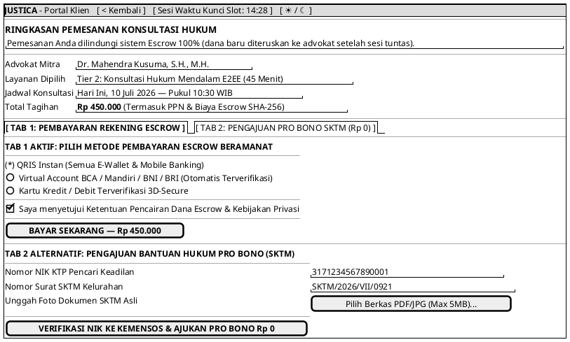

# MOCK-J-CL-03 [ORI]: Checkout Pembayaran Escrow & Pengajuan Pro Bono SKTM Justica

## 1. METADATA SPESIFIKASI (ENGINEERING EDITION)
| Atribut | Nilai Spesifikasi |
| :--- | :--- |
| **ID Mockup** | `MOCK-J-CL-03` |
| **Nama Halaman** | Checkout Escrow & Pro Bono Claim (`client.justica.id/checkout/REQ-202607-003`) |
| **Aktor Target** | Klien Hukum Terverifikasi (*Client*) |
| **Ref. Use Case** | `J-UC05` (Pembayaran Escrow 75/25), `J-UC15` (Klaim Layanan Pro Bono SKTM) |
| **Peta Navigasi (`from` -> `to`)** | `MOCK-J-CL-02B` -> `MOCK-J-CL-03` -> `MOCK-J-CL-03B` (Invoice VA/QRIS) |
| **Kepatuhan Keamanan** | SHA-256 Transaction Idempotency Key, Kemensos DTKS NIK API Verification |

---

## 2. DIAGRAM WIREFRAME LOGIS (PLANTUML SALT)

---

## 3. CATATAN ARSITEKTUR TEKNIS
1. **Idempotency Key Tracking:** Setiap klik tombol bayar menyertakan header `X-Idempotence-Key: SHA256(user_id + slot_id + timestamp)` untuk mencegah penagihan ganda.
