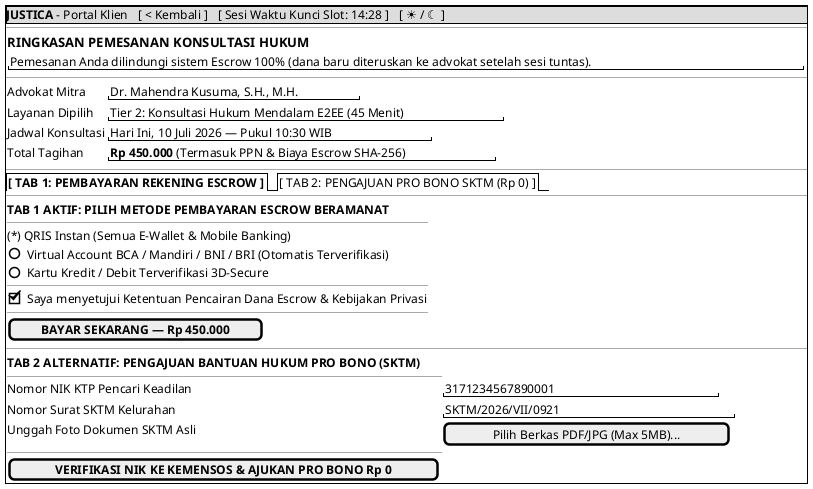

# MOCK-J-CL-03 [ORI]: Checkout Pembayaran Escrow & Pengajuan Pro Bono SKTM Justica

## 1. METADATA SPESIFIKASI (ENGINEERING EDITION)
| Atribut | Nilai Spesifikasi |
| :--- | :--- |
| **ID Mockup** | `MOCK-J-CL-03` |
| **Nama Halaman** | Checkout Escrow & Pro Bono Claim (`client.justica.id/checkout/REQ-202607-003`) |
| **Aktor Target** | Klien Hukum Terverifikasi (*Client*) |
| **Ref. Use Case** | `J-UC05` (Pembayaran Escrow 75/25), `J-UC15` (Klaim Layanan Pro Bono SKTM) |
| **Peta Navigasi (`from` -> `to`)** | `MOCK-J-CL-02B` -> `MOCK-J-CL-03` -> `MOCK-J-CL-03B` (Invoice VA/QRIS) |
| **Kepatuhan Keamanan** | SHA-256 Transaction Idempotency Key, Kemensos DTKS NIK API Verification |

---

## 2. DIAGRAM WIREFRAME LOGIS (PLANTUML SALT)

---

## 3. KAMUS DATA & ELEMEN UI (DATA FIELD DICTIONARY)
| ID Elemen | Nama Komponen UI | Tipe Data | Wajib? | Aturan Validasi Logis & Batasan Kepatuhan |
| :--- | :--- | :--- | :---: | :--- |
| `CHK-RAD-01` | `Metode Pembayaran` | Radio Selection| Ya* | Pilihan QRIS, VA, atau Kartu Kredit. *Wajib jika berada di Tab 1 (Escrow). |
| `CHK-CHK-01` | `Consent Escrow`    | Boolean | Ya | Wajib `true` untuk memproses pembayaran Escrow. |
| `CHK-IN-01`  | `NIK Pemohon SKTM`  | Numeric | Ya* | 16 Digit numerik (`^[0-9]{16}$`). *Wajib jika mengajukan di Tab 2 (Pro Bono). |
| `CHK-IN-02`  | `Nomor SKTM`        | String  | Ya* | Nomor resmi surat keterangan tidak mampu kelurahan. |
| `CHK-UP-01`  | `Unggah Berkas SKTM`| File Binary | Ya* | Format `.pdf`/`.jpg` maksimal 5MB. |

---

## 4. MATRIKS EVENT HANDLER & TRANSISI LOGIKA
| Event Trigger | Komponen UI | Kondisi Guard (*Pre-Condition*) | Aksi Sistem (*System Response*) | Transisi Layar (*Target*) |
| :--- | :--- | :--- | :--- | :--- |
| `onClick` | Tombol `[ BAYAR SEKARANG ]` | `Consent == true` & `Timer > 0` | Generate Idempotency Key SHA-256, buat tagihan Virtual Account/QRIS. | -> `MOCK-J-CL-03B` (Invoice Resi) |
| `onClick` | Tombol `[ AJUKAN PRO BONO ]`| Form SKTM lengkap & file valid | Panggil API Kemensos DTKS untuk verifikasi NIK, kirim ke antrean verifikasi admin. | -> `MOCK-J-CL-03B` (Status SKTM) |

---

## 5. KONTRAK INTEGRASI API & DATA BINDING (*API BINDING CONTRACT*)
| Aksi UI | HTTP Method & Endpoint | Payload Request JSON | Struktur Response JSON |
| :--- | :--- | :--- | :--- |
| Checkout Pembayaran Escrow | `POST /api/v2/client/checkout/escrow` | *Header: `X-Idempotence-Key: SHA256(...)`* `{"booking_id": "REQ-202607-003", "payment_method": "QRIS"}` | `201 Created: {"invoice_id": "INV-003", "qris_payload": "0002010102...", "total_amount": 450000}` |
| Klaim Pro Bono SKTM | `POST /api/v2/client/checkout/probono` | `{"booking_id": "REQ-202607-003", "nik": "3171...", "sktm_number": "SKTM/2026/VII", "file_hash": "a9f8..."}` | `202 Accepted: {"claim_id": "PB-003", "status": "PENDING_KEMENSOS_DTKS"}` |

---

## 6. MATRIKS PENANGANAN ERROR & CATATAN ARSITEKTUR TEKNIS
| Kode HTTP / Error | Skenario Pemicu Kegagalan | Pesan UI ke Pengguna (*User-Facing Message*) | Mekanisme Pemulihan / Fallback |
| :--- | :--- | :--- | :--- |
| `408 Request Timeout`| Waktu kunci slot 15 menit habis sebelum checkout | `"Waktu penguncian slot telah berakhir. Silakan pilih kembali jadwal konsultasi Anda."` | Tombol `BAYAR SEKARANG` dinonaktifkan; tautan kembali ke `CL-02B` disajikan. |
| `422 Unprocessable`| NIK tidak terdaftar di DTKS Kemensos | `"NIK Anda belum terdaftar dalam Data Terpadu Kesejahteraan Sosial (DTKS). Pengajuan Pro Bono memerlukan peninjauan manual."` | Pengajuan dialihkan ke jalur verifikasi manual Admin (`AM-02`). |

### Catatan Arsitektur Teknis:
1. **Idempotency Key Tracking:** Setiap klik tombol bayar menyertakan header `X-Idempotence-Key: SHA256(user_id + slot_id + timestamp)` untuk mencegah penagihan ganda.
2. **Kemensos DTKS Verification:** Pengajuan Pro Bono otomatis diperiksa ke database Terpadu Kesejahteraan Sosial sebelum disetujui Admin (`AM-02`).
