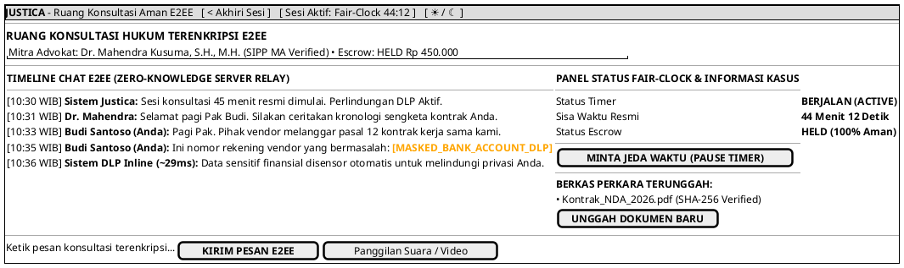

# MOCK-J-CL-04 [ORI]: Ruang Obrolan Hukum Online E2EE Justica

## 1. METADATA SPESIFIKASI (ENGINEERING EDITION)
| Atribut | Nilai Spesifikasi |
| :--- | :--- |
| **ID Mockup** | `MOCK-J-CL-04` |
| **Nama Halaman** | Ruang Obrolan Hukum Terenkripsi E2EE (`client.justica.id/room/REQ-202607-003`) |
| **Aktor Target** | Klien Hukum Terverifikasi (*Client*) & Advokat Mitra |
| **Ref. Use Case** | `J-UC04` (Konsultasi Real-Time E2EE), `J-UC10` (Fair-Clock Timer & Inline DLP) |
| **Peta Navigasi (`from` -> `to`)** | `MOCK-J-CL-03B` -> `MOCK-J-CL-04` -> `MOCK-J-CL-06` (Async Room Deliverable), `MOCK-J-CL-07` (Rating Modal) |
| **Kepatuhan Keamanan** | WebRTC/WebSocket E2EE (AES-GCM-256), Inline DLP Masking (<30ms latency), Fair-Clock Timer |

---

## 2. DIAGRAM WIREFRAME LOGIS (PLANTUML SALT)

---

## 3. KAMUS DATA & ELEMEN UI (DATA FIELD DICTIONARY)
| ID Elemen | Nama Komponen UI | Tipe Data | Wajib? | Aturan Validasi Logis & Batasan Kepatuhan |
| :--- | :--- | :--- | :---: | :--- |
| `CHAT-MSG-01`| `Input Pesan Chat` | String | Ya | Maksimal 2000 karakter, melewati pemeriksaan *Inline DLP Scanner* sebelum enkripsi. |
| `CHAT-TMR-01`| `Fair-Clock Timer` | Synchronized Clock| Ya | Sinkronisasi detik dengan *server authoritative clock* melalui WebSocket. |
| `CHAT-BTN-01`| `Kirim Pesan E2EE` | Action Button | Ya | Enkripsi *client-side AES-GCM-256* menggunakan *shared secret key* sesi. |
| `CHAT-BTN-02`| `Pause Timer`      | Action Button | Ya | Meminta persetujuan jeda waktu (*mutual pause*) kepada advokat mitra. |
| `CHAT-BTN-03`| `Akhiri Sesi`      | Action Button | Ya | Memicu penyelesaian sesi resmi dan menampilkan modal rating `MOCK-J-CL-07`. |

---

## 4. MATRIKS EVENT HANDLER & TRANSISI LOGIKA
| Event Trigger | Komponen UI | Kondisi Guard (*Pre-Condition*) | Aksi Sistem (*System Response*) | Transisi Layar (*Target*) |
| :--- | :--- | :--- | :--- | :--- |
| `onSubmit`| `Input Pesan Chat` | `msg.length > 0` | Pemindaian DLP <30ms, enkripsi AES-GCM-256, kirim via WebSocket relay. | Tetap di `MOCK-J-CL-04` |
| `onClick` | Tombol `[ MINTA JEDA ]`| `Timer.status == RUNNING` | Mengirim sinyal `PAUSE_REQUEST` ke advokat. Jika disetujui, timer berhenti sementara. | Tetap di `MOCK-J-CL-04` |
| `onClick` | Tombol `[ Akhiri Sesi ]`| Konfirmasi modal `Yes` | Menutup sesi WebSocket, memindahkan status Escrow ke `READY_RELEASE`, buka rating. | -> `MOCK-J-CL-07` (Rating Modal) |

---

## 5. KONTRAK INTEGRASI API & DATA BINDING (*API BINDING CONTRACT*)
| Aksi UI | HTTP Method & Endpoint | Payload Request JSON | Struktur Response JSON |
| :--- | :--- | :--- | :--- |
| Kirim Pesan E2EE | `WSS /ws/v2/chat/REQ-202607-003` | `{"type": "MESSAGE", "ciphertext_aes": "9a8b...", "dlp_scanned": true}` | `{"event": "MSG_ACK", "timestamp": "10:35:12Z"}` |
| Sinkronisasi Fair-Clock| `GET /api/v2/room/REQ-202607-003/timer` | *Headers: `Authorization: Bearer <jwt>`* | `200 OK: {"remaining_seconds": 2652, "state": "RUNNING"}` |

---

## 6. MATRIKS PENANGANAN ERROR & CATATAN ARSITEKTUR TEKNIS
| Kode HTTP / Error | Skenario Pemicu Kegagalan | Pesan UI ke Pengguna (*User-Facing Message*) | Mekanisme Pemulihan / Fallback |
| :--- | :--- | :--- | :--- |
| `1006 WS Closed` | Koneksi WebSocket terputus sewaktu-waktu | `"Koneksi jaringan terputus sementara. Menghubungkan kembali ke ruang obrolan..."` | *Auto-reconnect exponential backoff*; timer Fair-Clock otomatis dijeda (*auto-pause*). |
| `400 DLP Blocked`| Teks mengandung informasi terlarang/berbahaya | `"Pesan dicegah sistem karena mengandung nomor kartu kredit/rekening yang tidak sah."` | Pesan disensor lokal dan tidak dikirim ke relai server. |

### Catatan Arsitektur Teknis:
1. **Inline DLP Latency:** Scanner Data Loss Prevention bekerja di level *web worker* browser dengan latensi <30 milidetik sebelum pesan dienkripsi.
2. **Fair-Clock Protocol:** Waktu tidak berkurang saat terjadi gangguan koneksi jaringan pada klien atau advokat.
