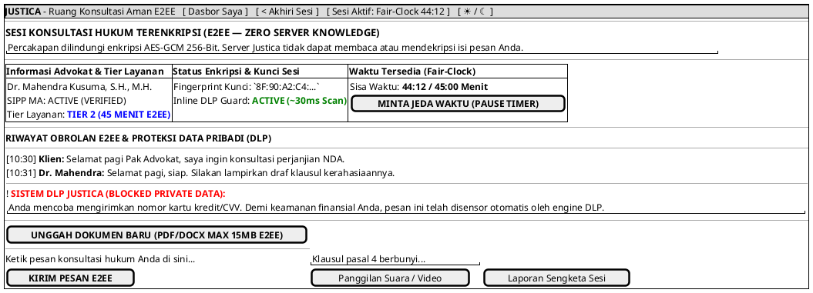

# MOCK-J-CL-04 [ORI]: Ruang Obrolan Hukum Online E2EE (Fair-Clock & Inline DLP) Justica

## 1. METADATA SPESIFIKASI (ENGINEERING EDITION)
| Atribut | Nilai Spesifikasi |
| :--- | :--- |
| **ID Mockup** | `MOCK-J-CL-04` |
| **Nama Halaman** | Ruang Konsultasi Hukum Enkripsi Ujung-ke-Ujung (`client.justica.id/room/{id}`) |
| **Aktor Target** | Klien Hukum Terverifikasi & Advokat Berlisensi SIPP |
| **Ref. Use Case** | `J-UC04` (`ST-J-08`: Konsultasi E2EE Chat/Call, Tiering Engine, Fair-Clock Timer, Inline DLP Guard), `J-UC10` (`ST-J-09`: SLA Respons Advokat & AFK Auto-Refund), `J-UC13` (`ST-J-10`: Unggah Bukti Zero-Knowledge) |
| **Peta Navigasi (`from` -> `to`)** | `MOCK-J-CL-03B` -> `MOCK-J-CL-04` -> `MOCK-J-CL-02A` (Dasbor Saya), `MOCK-J-CL-07` (Modal Rating & Ulasan), `MOCK-J-CL-08` (Pusat Sengketa/Dispute) |
| **Kepatuhan Keamanan** | Client-Side Signal AES-GCM Enkripsi, Zero-Storage Server Relay, Inline Regex DLP Scanner (~30ms), WebRTC SRTP Call |

---

## 2. DIAGRAM WIREFRAME LOGIS (PLANTUML SALT)

---

## 3. KAMUS DATA & ELEMEN UI (DATA FIELD DICTIONARY)
| ID Elemen | Nama Komponen UI | Tipe Data | Wajib? | Aturan Validasi Logis & Batasan Kepatuhan |
| :--- | :--- | :--- | :---: | :--- |
| `CHAT-NAV-01`| `Toggle Theme Mode` | Action Button | Ya | Mengubah tema visual antarmuka Light/Dark Mode di local storage. |
| `CHAT-NAV-02`| `Tombol Dasbor Saya`| Action Button | Ya | Kembali sementara ke halaman dasbor utama klien `MOCK-J-CL-02A` tanpa mengakhiri sesi. |
| `CHAT-BTN-03`| `Akhiri Sesi`       | Action Button | Ya | Memicu terminasi *handshake* kunci sesi dan pembukaan modal rating `CL-07`. |
| `CHAT-BTN-02`| `Pause Fair-Clock`  | Action Button | Ya | Meminta jeda sementara penghitungan waktu (maksimal 2 kali per sesi). |
| `CHAT-BTN-05`| `Unggah Dokumen`    | Action Button | Ya | Berkas dienkripsi lokal di browser sebelum diunggah ke *ephemeral vault*. |
| `CHAT-MSG-01`| `Input Pesan Obrolan`| String Text  | Ya | Diberlakukan pemindaian DLP Regex sebelum dikirim melalui WebSocket E2EE. |
| `CHAT-BTN-01`| `Kirim Pesan`       | Action Button | Ya | Memicu enkripsi AES-GCM lokal dengan kunci publik advokat. |
| `CHAT-BTN-04`| `Panggilan WebRTC`  | Action Button | Ya | Membuka saluran komunikasi suara/video terenkripsi SRTP (*Peer-to-Peer*). |
| `CHAT-BTN-06`| `Laporan Sengketa`  | Action Button | Ya | Mengalihkan klien ke pusat pelaporan masalah dan pemantauan sengketa (`CL-08 + CL-09`). |

---

## 4. MATRIKS EVENT HANDLER & TRANSISI LOGIKA
| Event Trigger | Komponen UI | Kondisi Guard (*Pre-Condition*) | Aksi Sistem (*System Response*) | Transisi Layar (*Target*) |
| :--- | :--- | :--- | :--- | :--- |
| `onClick` | Tombol `[ KIRIM PESAN ]`    | `Input != Empty` & DLP Lolos | Enkripsi pesan di memori browser, kirim *ciphertext* via WebSocket. | Tetap di `MOCK-J-CL-04` |
| `onClick` | Tombol `[ UNGGAH DOKUMEN ]` | `File size <= 15MB` | Enkripsi binary berkas dengan AES-GCM, unggah *chunked stream*. | Tetap di `MOCK-J-CL-04` |
| `onClick` | Tombol `[ Panggilan Suara ]`| Handshake E2EE sukses | Inisiasi negosiasi WebRTC SRTP dengan advokat mitra. | Sesi WebRTC Terbuka |
| `onClick` | Tombol `[ PAUSE TIMER ]`    | `pause_count < 2` | Hentikan sementara detak timer di server sinkronisasi NTP. | Tetap (Status `PAUSED`) |
| `onClick` | Tombol `[ AKHIRI SESI ]`    | Konfirmasi modal | Tutup WebSocket, hapus kunci dekripsi sesi dari RAM browser. | -> `MOCK-J-CL-07` (Rating Modal) |
| `onClick` | Tombol `[ Laporan Sengketa ]`| Sesi Aktif / Berakhir | Membuka formulir pelaporan masalah etika/teknis sesi konsultasi. | -> `MOCK-J-CL-08` (Form Whistleblowing & Dispute) |
| `onClick` | Header `[ Dasbor Saya ]`    | Sesi Aktif | Kembali ke halaman dasbor utama klien tanpa mengakhiri koneksi E2EE. | -> `MOCK-J-CL-02A` |
| `onClick` | Tombol `[ ☀ / ☾ Mode ]`     | Tidak ada | Mengganti tema visual antarmuka Light/Dark Mode. | Tetap di `MOCK-J-CL-04` |

---

## 5. KONTRAK INTEGRASI API & DATA BINDING (*API BINDING CONTRACT*)
| Aksi UI | HTTP Method & Endpoint | Payload Request JSON | Struktur Response JSON |
| :--- | :--- | :--- | :--- |
| Kirim Pesan Terenkripsi | `POST /api/v2/chat/send-ciphertext` | `{"session_id": "ROOM-091", "ciphertext": "base64...", "iv": "hex...", "tag": "hex..."}` | `200 OK: {"delivered": true, "server_timestamp": "2026-07-10T10:31:00Z"}` |

---

## 6. MATRIKS PENANGANAN ERROR & CATATAN ARSITEKTUR TEKNIS
| Kode HTTP / Error | Skenario Pemicu Kegagalan | Pesan UI ke Pengguna (*User-Facing Message*) | Mekanisme Pemulihan / Fallback |
| :--- | :--- | :--- | :--- |
| `DLP_VIOLATION_ERR` | Klien mengetik data sensitif (PAN Kartu, CVV, OTP) | `"Pesan dicegah: Mengandung data finansial sensitif yang dilindungi kebijakan Justica."` | Pesan dibatalkan sebelum proses enkripsi dan tidak pernah terkirim. |
| `1008 WS Closed`    | Koneksi terputus karena gangguan jaringan | `"Koneksi aman terputus. Menghubungkan ulang ke ruang E2EE..."` | *Auto-reconnect* dengan mekanisme *exponential backoff*. |

### Catatan Arsitektur Teknis:
1. **Zero-Storage Relay:** Server Justica hanya bertindak sebagai pipa transmisi (*relay pipe*) pesan terenkripsi dan tidak memiliki kunci privat untuk membaca riwayat konsultasi klien.
2. **Inline Client-Side DLP:** Pemindaian Data Loss Prevention (DLP) dilakukan secara lokal di browser sebelum pesan dienkripsi untuk melindungi klien dari kebocoran data pribadi yang tidak disengaja.
