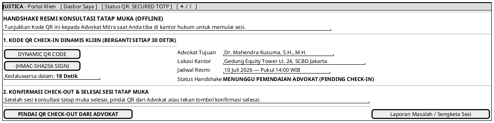

# MOCK-J-CL-05 [ORI]: Check-in & Check-out Konsultasi Offline Resmi Justica

## 1. METADATA SPESIFIKASI (ENGINEERING EDITION)
| Atribut | Nilai Spesifikasi |
| :--- | :--- |
| **ID Mockup** | `MOCK-J-CL-05` |
| **Nama Halaman** | Handshake Konsultasi Offline Dynamic QR (`client.justica.id/offline-handshake`) |
| **Aktor Target** | Klien Hukum Terverifikasi (*Client*) |
| **Ref. Use Case** | `J-UC06` (Konsultasi Offline Resmi Tatap Muka), `J-UC11` (Dynamic QR Handshake Check-in/out) |
| **Peta Navigasi (`from` -> `to`)** | `MOCK-J-CL-03B` -> `MOCK-J-CL-05` -> `MOCK-J-CL-07` (Modal Rating Setelah Check-out) |
| **Kepatuhan Keamanan** | TOTP-Based Rotating Dynamic QR (TTL 30s), Geo-Fencing Proximity Check, HMAC-SHA256 Sign |

---

## 2. DIAGRAM WIREFRAME LOGIS (PLANTUML SALT)

---

## 3. KAMUS DATA & ELEMEN UI (DATA FIELD DICTIONARY)
| ID Elemen | Nama Komponen UI | Tipe Data | Wajib? | Aturan Validasi Logis & Batasan Kepatuhan |
| :--- | :--- | :--- | :---: | :--- |
| `OFF-QR-01`  | `Dynamic QR Image` | Base64 PNG | Ya | Berisi payload JWT tersandi `HMAC-SHA256(booking_id + timestamp)` rotasi tiap 30s. |
| `OFF-TMR-01` | `Countdown QR`     | Integer    | Ya | Hitung mundur 30 detik sebelum *auto-refresh* QR token baru. |
| `OFF-BTN-01` | `Pindai QR Check-out`| Action     | Ya | Mengaktifkan kamera HTML5 untuk memindai QR akhir sesi dari layar advokat (`AD-03`). |

---

## 4. MATRIKS EVENT HANDLER & TRANSISI LOGIKA
| Event Trigger | Komponen UI | Kondisi Guard (*Pre-Condition*) | Aksi Sistem (*System Response*) | Transisi Layar (*Target*) |
| :--- | :--- | :--- | :--- | :--- |
| `onInterval`  | `Countdown QR`     | `Timer == 0` | Request token QR dinamis baru dari server, me-render ulang gambar QR. | Tetap di `MOCK-J-CL-05` |
| `onScanSuccess`| Pemindai QR Check-out| HMAC Valid & Geo-Fence Match | Mencatat penyelesaian sesi offline, melepas Escrow ke advokat. | -> `MOCK-J-CL-07` (Rating Modal) |

---

## 5. KONTRAK INTEGRASI API & DATA BINDING (*API BINDING CONTRACT*)
| Aksi UI | HTTP Method & Endpoint | Payload Request JSON | Struktur Response JSON |
| :--- | :--- | :--- | :--- |
| Refresh QR Token | `GET /api/v2/client/handshake/token?booking_id=REQ-003` | *Headers: `Authorization: Bearer <jwt>`* | `200 OK: {"qr_token": "eyJhbG...", "expires_in": 30}` |
| Submit Check-out Scan| `POST /api/v2/client/handshake/checkout` | `{"booking_id": "REQ-003", "advocate_qr_token": "eyJ...", "client_coords": {"lat": -6.22, "lng": 106.80}}` | `200 OK: {"handshake_status": "COMPLETED", "escrow_released": true}` |

---

## 6. MATRIKS PENANGANAN ERROR & CATATAN ARSITEKTUR TEKNIS
| Kode HTTP / Error | Skenario Pemicu Kegagalan | Pesan UI ke Pengguna (*User-Facing Message*) | Mekanisme Pemulihan / Fallback |
| :--- | :--- | :--- | :--- |
| `401 Expired QR`  | Advokat memindai QR yang sudah lewat 30 detik | `"Kode QR telah kedaluwarsa. Sistem menyajikan kode QR baru secara otomatis."` | Gambar QR diperbarui secara instan tanpa perlu memuat ulang halaman. |
| `403 Geo Mismatch`| Jarak koordinat GPS klien dan kantor advokat >500m | `"Verifikasi lokasi tidak cocok. Pastikan fitur GPS diaktifkan di lokasi kantor advokat."` | Tampilkan panduan mengaktifkan izin geolokasi perangkat browser. |

### Catatan Arsitektur Teknis:
1. **Anti-Fraud QR Handshake:** Rotasi 30 detik mencegah tangkapan layar (*screenshot*) disalahgunakan oleh pihak yang tidak hadir secara fisik.
