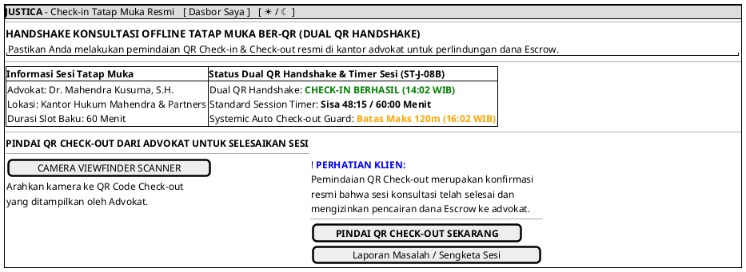

# MOCK-J-CL-05 [ORI]: Check-in/out Konsultasi Offline Resmi (Dynamic QR Scan) Justica

## 1. METADATA SPESIFIKASI (ENGINEERING EDITION)
| Atribut | Nilai Spesifikasi |
| :--- | :--- |
| **ID Mockup** | `MOCK-J-CL-05` |
| **Nama Halaman** | Check-in & Check-out Tatap Muka Resmi ber-QR (`client.justica.id/offline-handshake`) |
| **Aktor Target** | Klien Hukum Terverifikasi & Advokat Berlisensi SIPP |
| **Ref. Use Case** | `J-UC03, J-UC04` (`ST-J-08B`: Konsultasi Tatap Muka Resmi Dual QR Handshake Check-in & Check-out, 60m Standard Timer, 120m Auto Check-out) |
| **Peta Navigasi (`from` -> `to`)** | `MOCK-J-CL-02A` -> `MOCK-J-CL-05` -> `MOCK-J-CL-07` (Modal Rating & Ulasan), `MOCK-J-CL-08` (Pusat Sengketa) |
| **Kepatuhan Keamanan** | Dual QR Handshake Token (TTL 30s), Geofencing Office Verification, Standard Timer 60m, Systemic Auto Check-out 120m |

---

## 2. DIAGRAM WIREFRAME LOGIS (PLANTUML SALT)

---

## 3. KAMUS DATA & ELEMEN UI (DATA FIELD DICTIONARY)
| ID Elemen | Nama Komponen UI | Tipe Data | Wajib? | Aturan Validasi Logis & Batasan Kepatuhan |
| :--- | :--- | :--- | :---: | :--- |
| `OFF-NAV-01` | `Tautan Dasbor Saya`| Navigation Link | Ya | Kembali ke dasbor utama klien `MOCK-J-CL-02A`. |
| `OFF-NAV-02` | `Toggle Theme Mode` | Action Button   | Ya | Mengubah tema visual antarmuka Light/Dark Mode di local storage. |
| `OFF-BTN-01` | `Tombol Scan QR`    | Camera Action   | Ya | Membuka *video stream* kamera ponsel dengan pemindai token waktu dinamik. |
| `OFF-BTN-02` | `Laporan Sengketa`  | Action Button   | Ya | Membuka formulir pelaporan sengketa jika terjadi pelanggaran kesepakatan sesi offline (`MOCK-J-CL-08`). |

---

## 4. MATRIKS EVENT HANDLER & TRANSISI LOGIKA
| Event Trigger | Komponen UI | Kondisi Guard (*Pre-Condition*) | Aksi Sistem (*System Response*) | Transisi Layar (*Target*) |
| :--- | :--- | :--- | :--- | :--- |
| `onClick` | Tombol `[ PINDAI QR CHECK-OUT ]`| `Camera Permission == Granted`| Verifikasi token QR waktu dinamis (<30 detik TTL), lepas kunci Escrow. | -> `MOCK-J-CL-07` (Rating Modal) |
| `onClick` | Tombol `[ Laporan Sengketa ]`   | Sesi Offline Aktif | Mengalihkan ke formulir Whistleblowing & Dispute Monitoring. | -> `MOCK-J-CL-08` (Form Whistleblowing & Dispute) |
| `onClick` | Header `[ Dasbor Saya ]`        | Sesi Klien Aktif | Kembali ke halaman dasbor utama klien. | -> `MOCK-J-CL-02A` |
| `onClick` | Tombol `[ ☀ / ☾ Mode ]`         | Tidak ada | Mengganti tema visual antarmuka Light/Dark Mode. | Tetap di `MOCK-J-CL-05` |

---

## 5. KONTRAK INTEGRASI API & DATA BINDING (*API BINDING CONTRACT*)
| Aksi UI | HTTP Method & Endpoint | Payload Request JSON | Struktur Response JSON |
| :--- | :--- | :--- | :--- |
| Kirim Handshake QR | `POST /api/v2/offline-session/handshake` | `{"session_id": "OFF-102", "qr_token": "TOTP...", "geo_lat": -6.208, "geo_lng": 106.845}` | `200 OK: {"handshake_status": "COMPLETED", "escrow_payout": "AUTHORIZED"}` |

---

## 6. MATRIKS PENANGANAN ERROR & CATATAN ARSITEKTUR TEKNIS
| Kode HTTP / Error | Skenario Pemicu Kegagalan | Pesan UI ke Pengguna (*User-Facing Message*) | Mekanisme Pemulihan / Fallback |
| :--- | :--- | :--- | :--- |
| `400 Token Expired`| QR Code Advokat kedaluwarsa (>30s) | `"QR Code kedaluwarsa. Minta advokat memperbarui tampilan QR di layar mereka."` | Advokat memindai atau me-refresh QR TOTP baru. |
| `403 Location Mismatch`| Koordinat GPS klien jauh dari kantor advokat | `"Lokasi Anda berada di luar radius kantor advokat terdaftar."` | Verifikasi geolokasi ulang atau penandatanganan konfirmasi manual darurat. |

### Catatan Arsitektur Teknis:
1. **Time-Based Cryptographic QR:** Token QR yang ditampilkan advokat diperbarui setiap 30 detik untuk mencegah manipulasi atau tangkapan layar (*anti-replay attack*).
2. **Escrow Safeguard:** Dana Escrow tetap ditahan oleh platform Justica jika pemindaian QR Check-out belum terjadi atau jika ada laporan sengketa aktif.
