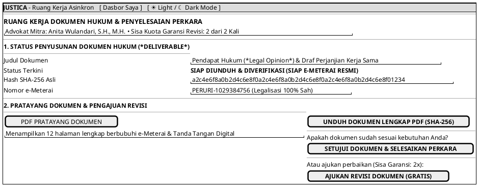

# MOCK-J-CL-06 [ORI]: Ruang Kerja Asinkron Deliverable & Download Gate Justica

## 1. METADATA SPESIFIKASI (ENGINEERING EDITION)
| Atribut | Nilai Spesifikasi |
| :--- | :--- |
| **ID Mockup** | `MOCK-J-CL-06` |
| **Nama Halaman** | Ruang Kerja Penyusunan Dokumen & Download Gate (`client.justica.id/deliverable/REQ-002`) |
| **Aktor Target** | Klien Hukum Terverifikasi (*Client*) |
| **Ref. Use Case** | `J-UC12` (Penyerahan & Unduh Deliverable e-Meterai SHA-256), `J-UC13` (Sistem Garansi Revisi) |
| **Peta Navigasi (`from` -> `to`)** | `MOCK-J-CL-02A` -> `MOCK-J-CL-06` -> `MOCK-J-CL-07` (Modal Rating Setelah Penyetujuan) |
| **Kepatuhan Keamanan** | SHA-256 Integrity Hash Check, e-Meterai Peruri Stamp API, WORM Download Audit Record |

---

## 2. DIAGRAM WIREFRAME LOGIS (PLANTUML SALT)

---

## 3. KAMUS DATA & ELEMEN UI (DATA FIELD DICTIONARY)
| ID Elemen | Nama Komponen UI | Tipe Data | Wajib? | Aturan Validasi Logis & Batasan Kepatuhan |
| :--- | :--- | :--- | :---: | :--- |
| `DEL-PRE-01` | `Pratayang PDF`    | Binary View | Ya | Menampilkan berkas dengan *watermark* sebelum persetujuan akhir. |
| `DEL-BTN-01` | `Unduh PDF SHA-256`| Action Button| Ya | Mengirimkan berkas binary asli lengkap metadata sertifikat e-Meterai. |
| `DEL-BTN-02` | `Setujui Dokumen`  | Action Button| Ya | Melepas 100% dana Escrow ke advokat (`PAID_OUT`) dan membuka modal rating `CL-07`. |
| `DEL-BTN-03` | `Ajukan Revisi`    | Action Button| Ya | Aktif jika `revisions_left > 0`. Membuka formulir masukan catatan revisi. |

---

## 4. MATRIKS EVENT HANDLER & TRANSISI LOGIKA
| Event Trigger | Komponen UI | Kondisi Guard (*Pre-Condition*) | Aksi Sistem (*System Response*) | Transisi Layar (*Target*) |
| :--- | :--- | :--- | :--- | :--- |
| `onClick` | Tombol `[ UNDUH DOKUMEN ]` | Berkas ter-stamp e-Meterai | Catat aktivitas pengunduhan ke WORM audit log, unduh berkas PDF. | Tetap di `MOCK-J-CL-06` |
| `onClick` | Tombol `[ SETUJUI DOKUMEN ]`| Konfirmasi modal `Yes` | Cairkan Escrow ke advokat, ubah status perkara jadi `COMPLETED`. | -> `MOCK-J-CL-07` (Rating Modal) |
| `onClick` | Tombol `[ AJUKAN REVISI ]` | `revisions_left > 0` | Kirim catatan revisi ke advokat (`AD-04`), kurangi kuota revisi. | Tetap (Status menjadi `IN_REVISION`) |

---

## 5. KONTRAK INTEGRASI API & DATA BINDING (*API BINDING CONTRACT*)
| Aksi UI | HTTP Method & Endpoint | Payload Request JSON | Struktur Response JSON |
| :--- | :--- | :--- | :--- |
| Setujui Deliverable | `POST /api/v2/client/deliverables/REQ-002/approve` | `{"consent_final": true, "client_sha256": "a2c4e6..."}` | `200 OK: {"case_status": "COMPLETED", "escrow_payout": "TRIGGERED"}` |
| Ajukan Revisi | `POST /api/v2/client/deliverables/REQ-002/revise` | `{"revision_notes": "Mohon perbaikan pasal 4 terkait masa garansi..."}` | `200 OK: {"status": "REVISION_REQUESTED", "revisions_left": 1}` |

---

## 6. MATRIKS PENANGANAN ERROR & CATATAN ARSITEKTUR TEKNIS
| Kode HTTP / Error | Skenario Pemicu Kegagalan | Pesan UI ke Pengguna (*User-Facing Message*) | Mekanisme Pemulihan / Fallback |
| :--- | :--- | :--- | :--- |
| `403 Quota Exceeded`| Mengajukan revisi saat kuota revisi sudah habis (0) | `"Batas garansi revisi gratis telah habis. Revisi tambahan memerlukan pesanan baru."` | Tombol `AJUKAN REVISI` dinonaktifkan dengan panduan add-on. |

### Catatan Arsitektur Teknis:
1. **e-Meterai Peruri Stamp API:** Dokumen hukum yang diunduh dari halaman ini adalah dokumen yang telah dibubuhi meterai elektronik sah dari Peruri.
